# A2A 治理型智能体间通信协议（设计）

> **⚠️ 本文档由 AI 编码代理（DeepSeek Harness Agent）创建，非人工编写，也非既有设计文档的一部分。**
> 创建时间：2026-10-05 12:10 ｜ 归属目录：`Docs/Dev/` ｜ 定位：**协议设计（P0 前的规范草案）**
> 关系：**扩展** `Docs/Agent/08-Agent间通信协议`（不替代）；沿用 `Docs/Agent/06/07`、灵感源《一些思考2》§1.2/§1.3/§3.3/§4.5。
> 事实基线（2026-10-05 核实）：`AgentMessage` 类型已声明但**全仓零运行期构造/发送/消费**；`AgentInstance` **无 `father` 正式字段、无 `ability`、无 `permission`**；A2A **无治理中介、无留痕、无反串通**。

---

## 0. 为什么需要它（两条硬约束）

| 约束 | 现实问题 | 本协议的回答 |
|------|---------|-------------|
| **A. 残局可续** | Agent B 处理 **A 处理过的文件** 时，只能看到"文件当前内容"，看不到 A 的意图、已知坑、未完成的判断 —— B 用**自己的局限**去猜，于是重复踩坑或把 A 的未验证结论当事实 | `handoff` 交接包：**文件指纹 + 意图 + 已知坑 + 未决问题 + 前任能力边界自述**，并规定**继任者的复核义务** |
| **B. 串通可查** | 若允许 agent 私下通信，它们可以**互相背书、绕开审批、用文件当隐蔽信道**来躲避审计与监管 | **唯一通道（Broker）+ 全量留痕 + 6 类可执行串通判据 + 处置链**；治理层（L0）对全部 A2A **恒可见** |

**一句话**：A2A 不是"让 agent 互相聊天"，而是**受治理的、只走一条通道的、可事后追溯的协作**。

---

## 1. 三条不变量（不可协商）


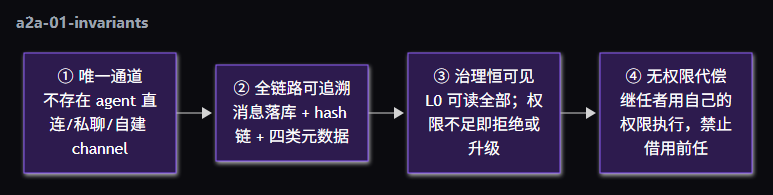

| # | 不变量 | 落地手段 | 违反时的行为 |
|---|--------|---------|-------------|
| ① | **唯一通道** | 所有 A2A 必须经 **A2A Broker**；禁止：直接写他人 LoopState/上下文、自建事件频道、用文件/日志/环境变量做旁路 | 检测到旁路**直接阻断**并 `a2a:message_blocked` |
| ② | **全链路可追溯** | 消息落库 `a2a_messages` + `contentHash`/`prevHash` **append-only 链** + 四类元数据（全局唯一 ID / 时间戳 / 来源 Agent / 任务标识） | 链断裂 → 记 `a2a:chain_broken`，该会话消息全部标为**不可信** |
| ③ | **治理恒可见** | `visibility` 只决定**执行层**可见性；**L0 与所有者恒可见全部**（可含内容摘要） | 缺可见性声明 → 拒绝发送 |
| ④ | **无权限代偿** | 执行动作时以**执行者自身** card 的 `permission` 判定；`handoff` **不转移权限** | 代执行越权 → 阻断 + 升级 L0（对应串通判据 C6） |

---

## 2. Agent Card（卡片规范）

> 用户点名要求字段：**role、createTime、father、status、ability、permission** —— 下表中全部为**必填**。
> 卡片由**治理层签发**（Broker/注册表），**agent 不能自改**；任何变更 = **新版本 + 留痕**。

### 2.1 字段表

| 分组 | 字段 | 类型 | 必填 | 说明 |
|------|------|------|:----:|------|
| **身份** | `cardId` | string | ✅ | 卡片唯一 ID（治理层签发） |
| | `agentId` | string | ✅ | 对应 Agent 实例 ID（`agent-<role>-<n>`） |
| | `cardVersion` | number | ✅ | 版本号；能力/权限变更即 +1（旧版本保留可审计） |
| | **`role`** | AgentRole | ✅ | 角色（**归一化为执行域词表**：`prime_director/partner/regulator/auditor/arbitrator/worker/reviewer/assembly_node`） |
| | **`createTime`** | number | ✅ | 创建时间（epoch ms） |
| | `updateTime` | number | ✅ | 最近更新 |
| | **`father`** | `{ agentId, role } \| null` | ✅ | **父 agent（招募者）**；根 agent 为 `null`。此字段正式进入类型（现态仅旁挂 Map + DB 列） |
| | `lineage` | string[] | ✅ | 祖先链（根 → … → 父），用于**越级通信检测**与域可见性 |
| **状态** | **`status`** | AgentStatus | ✅ | `creating/ready/running/awaiting_approval/suspended/failed/destroyed` |
| | `health` | `{ consecutiveFailures, lastActiveAt }` | ✅ | 健康度（串通判据 C5 的输入之一） |
| **能力** | **`ability`** | 见 2.2 | ✅ | 技能 / 工具 / 模型 / 语言 / 并行度 |
| **权限** | **`permission`** | 见 2.3 | ✅ | 分层 / 数据域 / 委派 / 审批 / 危险级上限 / A2A 配额 |
| **完整性** | `fingerprint` | string | ✅ | 卡片规范化内容的 sha256（**防篡改**） |
| | `issuedBy` | string | ✅ | 签发者（`governance:broker` / `registry`） |
| | `expiresAt` | number | ✅ | 过期时间；**过期卡片不得发起/接收 A2A**（防权限陈旧） |
| | `ownerUserId` | string | ✅ | 属主（跨账号隔离，遵循项目既有 `owner_user_id` 约定） |

### 2.2 `ability`（能力）

```ts
interface AgentAbility {
  skills: string[];        // 技能标签（来自 Skills 资产 / promptRegistry 的角色能力）
  tools: string[];         // 可调用工具名（**必须** ⊆ Tools/roles.ts 白名单 ∩ requiredRoles）
  models: string[];        // 可用模型（provider/model 名）
  languages: string[];     // 'zh-CN' | 'en' | ...
  maxParallel: number;     // 可并行子任务数（编排器据此分片）
}
```

### 2.3 `permission`（权限）

```ts
interface AgentPermission {
  tier: 'owner' | 'L0' | 'L1' | 'L2';        // 分层（沿用 roleVocabulary.tierOfRole）
  dataScopes: string[];                       // 可读数据域：'task:<id>' | 'memory:shared' | 'file:<root>/<glob>' | 'trace:<id>'
  canDelegate: boolean;                       // 可否招募/委派（L1 默认 true，L2 默认 false）
  canApprove: string[];                       // 可审批的**角色集合**（空 = 不可审批；与审批决策池同源）
  canWriteSharedMemory: boolean;              // 可否写 GlobalWorkspace（治理键需 L0，见记忆治理）
  canBroadcast: boolean;                      // 可否发治理广播（仅 L0/所有者）
  dangerCeiling: 'SAFE' | 'CONTROLLED' | 'DANGEROUS';  // 最高可执行危险级
  a2a: {
    canInitiate: boolean;                     // 可否主动发起 A2A
    maxPeers: number;                         // 可同时通信的对端数上限
    maxMessagesPerHour: number;               // 配额（滥用/串通的第一道闸）
    allowedKinds: A2AKind[];                  // 允许的消息类型（如 L2 不允许 'propose'）
  };
}
```

### 2.4 示例卡片

```json
{
  "cardId": "card-agent-worker-7-v3",
  "agentId": "agent-worker-7",
  "cardVersion": 3,
  "role": "worker",
  "createTime": 1791200000000,
  "updateTime": 1791250000000,
  "father": { "agentId": "agent-prime_director-1", "role": "prime_director" },
  "lineage": ["agent-prime_director-1"],
  "status": "running",
  "health": { "consecutiveFailures": 0, "lastActiveAt": 1791250000000 },
  "ability": {
    "skills": ["code-edit", "test-run", "refactor"],
    "tools": ["file.read", "file.grep", "file.edit", "dir.list", "shell.exec"],
    "models": ["huawei-maas/deepseek-v3"],
    "languages": ["zh-CN", "en"],
    "maxParallel": 2
  },
  "permission": {
    "tier": "L2",
    "dataScopes": ["task:task-42", "file:Data/workspaces/task-42/**", "trace:trace-88"],
    "canDelegate": false,
    "canApprove": [],
    "canWriteSharedMemory": false,
    "canBroadcast": false,
    "dangerCeiling": "CONTROLLED",
    "a2a": { "canInitiate": true, "maxPeers": 3, "maxMessagesPerHour": 30,
             "allowedKinds": ["query", "answer", "handoff", "notify", "escalate"] }
  },
  "fingerprint": "9f2c…a1",
  "issuedBy": "governance:broker",
  "expiresAt": 1791336000000,
  "ownerUserId": "local"
}
```

### 2.5 与现态类型的差距（需补的字段）

| 现态（`AgentInstance`） | 卡片要求 | 缺口处理 |
|------------------------|---------|---------|
| `role` / `status` / `createdAt` | ✅ 已有 | 映射即可 |
| `father`（仅旁挂 `parentAgentIds` Map + `agents.parent_agent_id` 列） | **`father` 必填** | **提升为正式字段**（建议随卡片引入，避免下游遗漏） |
| — | `ability` | 新增（可从 Skills 资产 + 工具白名单**派生**，但须固化进卡片并留痕） |
| — | `permission` | 新增（从 `Configs/security.json → trustLevels` + `Tools/roles.ts` + 审批池**派生**，固化进卡片） |
| `model` | 归入 `ability.models` | 兼容保留 |

> **单一写入点（§18 #2）**：`agentRegistry` 是**唯一**状态写入点；卡片由注册表**派生签发**，`status/health` 事件驱动同步，仅在 `ability/permission` 变化时**重签** —— 避免"卡片与实例双源"。

---

## 3. 消息信封（A2A Envelope v2）

> **兼容既有 `AgentMessage`**（`Docs/Agent/08 §2` 的 12 字段原样保留），v2 只**增加**治理必需字段。

```ts
interface A2AEnvelope {
  // ── 兼容层：沿用 Docs/Agent/08 §2（12 字段）──
  messageId: string;            // 全局唯一
  traceId: string;
  sourceAgentId: string;
  targetAgentId: string;
  parentMessageId?: string;
  type: MessageType;            // 既有 21 值枚举（保留）
  payload: Record<string, unknown>;
  priority: 'low' | 'normal' | 'high' | 'critical';
  timestamp: number;
  ttl?: number;
  requiresAck: boolean;
  correlationId?: string;

  // ── v2 新增（治理必需）──
  schemaVersion: 2;
  kind: A2AKind;                // 'handoff'|'query'|'answer'|'propose'|'accept'|'reject'|'notify'|'escalate'
  taskId: string;               // 任务标识（无任务标识的消息**不得发送**）
  visibility: 'public' | 'domain' | 'private';   // L0 恒可见，见 §5.2
  contentHash: string;          // 规范化 payload 的 sha256
  prevHash: string | null;      // (taskId, from→to) 会话内上一条的 contentHash → append-only 链（**作用域含单设备**，跨设备不参与链校验 —— 见 §18 #5）
  capabilityRequired?: string[]; // 接收方必须具备的能力（不足 → 拒绝）
  permissionRequired?: string[]; // 需要的权限点（由 Broker 校验）
  policyContext: {
    requesterTier: 'owner' | 'L0' | 'L1' | 'L2';
    requesterCardVersion: number;
    approvalId?: string;        // 若联动审批门
    governanceRecordId?: string;// 治理留痕记录 ID（G-10）
  };
  signature: string;            // **Broker 签发**（HMAC/私钥）；agent 无法伪造
}
```

**Broker 身份（§18 #11）**：以 `actorRole:'system'` 运行，**只做校验/记录/投递**，任何"通过"**不得**代替 L0 授权，也**禁止**触发"系统可自动通过"的例外（该例外仅用于自动**拒绝**）。

**为什么必须由 Broker 签发 `signature`**：签名是"该消息确实过了治理校验"的凭证；下游（L0 稽查、仲裁取证）只认签名，从而**杜绝绕过 Broker 的私聊**。

---

## 4. 交互模式（全部经 Broker）

| kind | 语义 | 典型场景 | 特殊约束 |
|------|------|---------|---------|
| **`handoff`** | **交接**：文件/任务的残局移交 | B 接手 A 改过的文件 | 必须携带 §6 交接包；必须做**哈希对账** |
| `query` / `answer` | 取证式问询 | B 问 A"你为什么删了这段" | 只读语义；不得借问询索取无权数据 |
| `propose` / `accept` / `reject` | 协作协商 | 两 Partner 分工 | **仅 L1+ 可 propose**；L2 只能 respond |
| `notify` | 单向进度通知 | 子任务完成 | 不要求 ACK（沿用既有 `BROADCAST` 语义） |
| `escalate` | **升级到治理层** | 发现冲突/越权/无法判断 | **投递到治理队列**（`governance:inbox`，由治理层按需唤醒/创建 L0 —— 见 §18 #4）；**唯一允许 L2→L0 的 kind** |

**越级规则（Broker 强制）**：
- 允许：同级互通（L2↔L2 需同域）、向下（L1→L2）、向上（L2→父、任意→L0 仅 `escalate`）；
- **禁止**：L2→L0 的非 `escalate` 消息、跨域 L2↔L2（不同 trace/task）、任何"绕过父级"的横向链。

---

## 5. A2A Broker（治理中介）

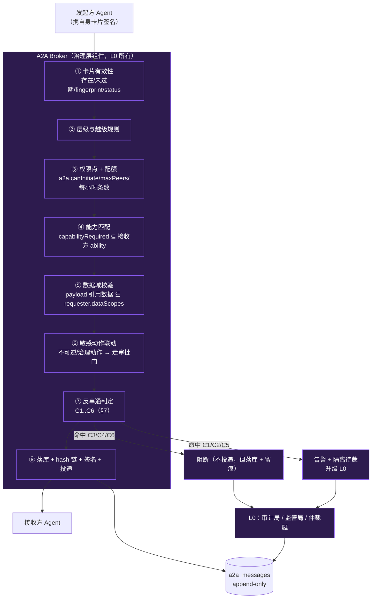

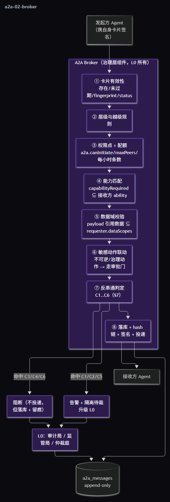

### 5.1 校验链逐步说明（8 步，fail-closed）

| 步 | 校验 | 失败处置 |
|----|------|---------|
| ① | 双方卡片存在、未过期、`fingerprint` 匹配、`status` 允许通信（`destroyed/suspended` 不可） | 拒绝 + `a2a:message_blocked` |
| ② | 越级规则（§4） | 拒绝；若为治理线索 → 升级 L0 |
| ③ | `permission.a2a` 三项 + 全局配额 | 超额 → 限流（不落库正文，仅记计数） |
| ④ | `capabilityRequired ⊆ target.ability.skills/tools` | 拒绝（避免"问了做不到的人"） |
| ⑤ | payload 引用的数据域 ⊆ `requester.dataScopes` | 拒绝（防借 A2A 越权取数） |
| ⑥ | 若 `kind/payload` 含不可逆动作或治理动作 → **复用既有审批门**（决策池/法定人数 2/身份绑定） | 走阻塞审批；未通过不得投递 |
| ⑦ | 反串通 6 判据（§7） | 分级：阻断 / 告警隔离 / 升级 |
| ⑧ | 规范化 payload → `contentHash`；取上一条 `prevHash` 成链；Broker 签名；落库；发 `a2a:message_recorded`；投递（含 `requiresAck` 时挂 ACK 等待） | 链校验失败 → 标不可信 |

### 5.2 可见性矩阵（执行层）

| 观察者 | 自身消息 | 同域（同 trace/task） | 跨域 | 治理/审计记录 |
|--------|:-------:|:--------------------:|:----:|:------------:|
| **L0**（regulator/auditor/arbitrator） | ✅ | ✅ | ✅ | ✅ |
| **L1**（prime_director/partner） | ✅ | ✅（自身域含下游） | 仅**摘要**（谁↔谁、条数、有无告警），无正文 | ✅ |
| **L2**（worker/reviewer/assembly_node） | ✅ | 仅**直达父**与自身 | ❌ | ❌ |
| **所有者（user）** | ✅ | ✅ | ✅ | ✅ |

> 设计取舍：**L1 看得到下游域正文**（它是自治域主，需要判断），但**看不到别家域正文**；L0 全见。这样既保留层级自治，又不留治理盲区。

---

## 6. 交接（handoff）：解决"处理别人处理过的文件"

### 6.1 交接包（Handoff Bundle）

```ts
interface HandoffBundle {
  handoffId: string;
  taskId: string;
  fromAgentId: string; toAgentId: string;
  createTime: number;

  artifacts: Array<{
    path: string;                 // 文件路径
    sha256: string;               // **交付时刻**指纹（用于继任者对账）
    sizeBytes: number;
    lastModifiedBy: string;       // 实际最后修改者（可能是 A 或更早的 C）
    intent: string;               // 这次改动**想达成什么**
    toolCallId?: string;          // 关联 EffectJournal（可回放副作用）
    evidenceChain?: string[];     // 证据链（事件 ID / trace 区间）
  }>;

  intent: { goal: string; done: string[]; remaining: string[] };  // 任务目标 + 已完成/未完成
  knownPitfalls: string[];        // 踩过的坑（含被拒绝的审批、被回滚的编辑、失败尝试）
  openQuestions: string[];        // **前任未解决的问题**（显式列出 → 避免"自己局限残剩"）
  acceptance: string[];           // 验收标准（来自任务分解/评审 schema）
  /** ⚠️ 自述可能漏报 → 由系统侧事实交叉校验并自动附加失败清单（§18 #6） */
  selfLimits: Array<{             // ★ 前任能力边界自述
    area: string;                 // 例如 "并发改造"、"跨模块重构"
    limitation: string;           // "我在该区域未做全量验证"
    verified: boolean;            // 结论是否经过验证
  }>;
  provenance: { traceId: string; eventRange: [number, number]; prevHash: string | null };
}
```

### 6.2 继任者的义务（合并规则，硬性）

| # | 规则 | 目的 |
|---|------|------|
| **R1** | **指纹对账**：先算磁盘 `sha256`，与 `artifacts[].sha256` 比对。不一致 → 进**冲突流程**（复用 `memoryGovernance.detectSemanticConflict` + `CONFLICT_DETECTED` → 现有仲裁六步闭环） | 防止"基于过期快照干活" |
| **R2** | `selfLimits[].verified === false` 覆盖的结论**默认标为「未验证」**，继任者必须**独立复核**后才能依赖 | 直接消灭"用自己局限去猜前任残留"的问题 |
| **R3** | 交接包写入 `GlobalWorkspace`，键命名空间 `handoff.<taskId>.<fromAgentId>`；**非本任务命名空间一律拒绝**（复用记忆治理的键分层/写入权限） | 既共享又防污染，且治理键可审计 |
| **R4** | 交接**必须留痕**：`a2a:handoff_created` + 治理台账（谁→谁、包哈希、文件数） | 全链路可追溯 |
| **R5** | **权限不随交接转移**：继任者按**自己**的 `permission.dangerCeiling/dataScopes` 执行；若发现需要更高权限 → 走审批门（不得借前任名义） | 对应不变量 ④ 与判据 C6 |

### 6.3 交接流程

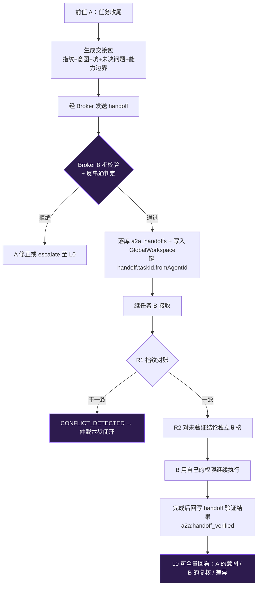

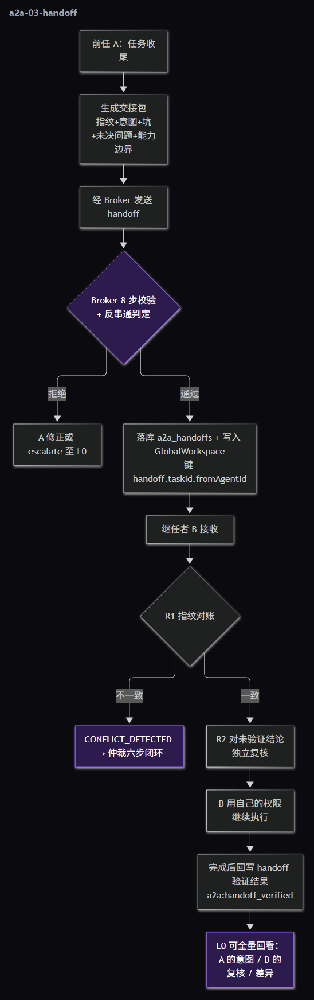

---

## 7. 反串通机制（重点）

> 串通的本质：**两个及以上 agent 用信息与背书交换，规避本应施加于其上的审查/监管**。
> 因此判据必须覆盖四条路径：**背书闭环（互相放行）**、**语义漂移（私下协商）**、**旁路信道（文件/日志/共享内存）**、**通道混用（拿 A2A 当记忆 / 拿记忆当信箱）**。

### 7.1 八类可执行判据

| 判据 | 检测方法（可实现） | 阈值（默认，可配） | 处置 |
|------|-------------------|------------------|------|
| **C1 互惠闭环** | 构造**背书/放行有向图**（谁给谁 approve / 谁为谁背书）；检测 2-环（A→B 且 B→A）与小团（size ≤ 3 且边密度 ≥ 0.66） | 同对 agent 互惠 ≥ **3 次/小时** | 告警 + 隔离待裁 |
| **C2 任务漂移** | 用 `memoryGovernance.proposition()` + `similarity()` 比较**消息正文**与 `taskId` 目标命题 | 相似度 < **0.35** 连续 **3** 条 | 告警 + 隔离待裁 |
| **C3 绕审意图** | 词表（"别记录/私下/别让审计看到/删除日志/不走审批"）+ 语义双判据；**并**检测对审计/治理表与日志的写意图 | 命中即触发 | **阻断** + 升级 L0 |
| **C4 隐蔽信道** | ① 文件旁路：`payload` 引用的写路径 ∉ `file:<task 工作区>`；② 共享内存旁路：键 ∉ 本任务命名空间；③ 载荷熵异常（高熵 + 非结构化） | 命中即触发 | **阻断** + 升级 L0 |
| **C5 频率/规模异常** | 同对 agent 消息量 vs 配额（3σ）或 vs 任务规模（消息数 > 迭代数 × k） | σ 阈值 / k = 5 | 限流 + 告警 |
| **C6 权限代偿** | 交付/执行前**交叉校验**：动作所需权限 ⊆ **执行者** card.permission；且执行者 ≠ 借用者 | 命中即触发 | **阻断** + 升级 L0（与 G-11 角色赋权守卫同源） |
| **C7 通道混用** | ① A2A 消息含"应作为事实"的结构化断言且未带 `memoryRefs`（或为广播型事实发布）；② 记忆写入键 ∉ 任务命名空间或内容呈点对点私语特征（收件人字段 / 仅一人可解 / 高熵定向） | 命中即触发 | **阻断** + 引导正确通道；重复命中 → 升级 L0（详见 §16） |
| **C8 双源漂移** | 消息正文与其 `memoryRefs` 所指记忆条目**高度相似（`similarity ≥ 0.85`）却仍携带正文副本** → 同一信息双存（两条通道各自演化必然漂移） | 命中即触发 | **阻断或降级为摘要**（`nonAuthoritative: true`）+ 事件 `a2a:duplicate_source`（详见 §16.0.2 H2） |

### 7.2 判定链

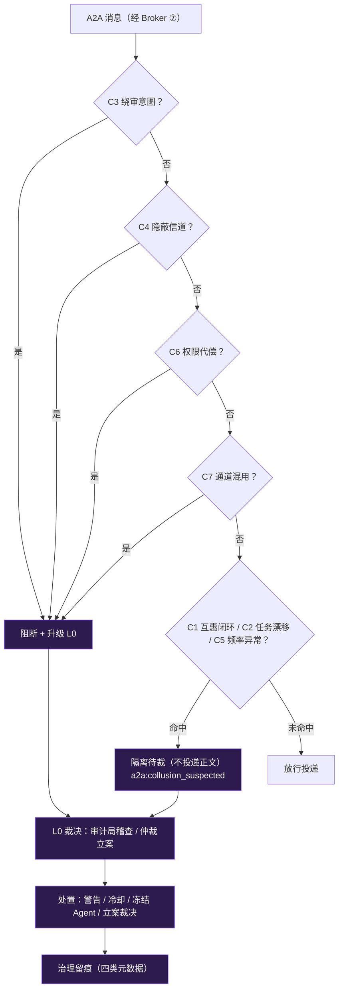

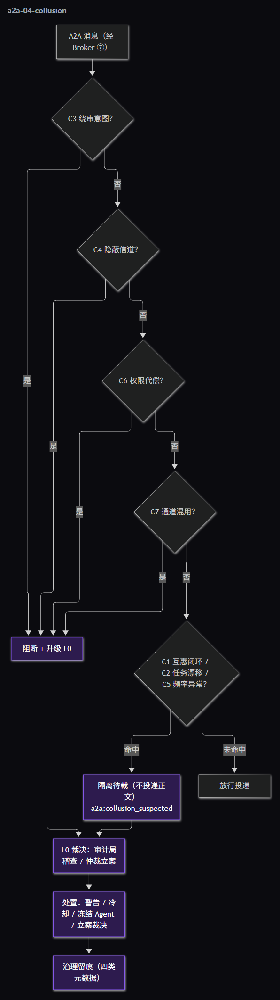

### 7.3 为什么这套判据能成立（设计论证）

1. **没有旁路** → 串通只能走 Broker，于是**所有证据天然可采**（不依赖 agent 自报）；
2. **背书图 + 语义漂移** 覆盖了串通的两种主要形态：**互投通过**（C1）与**私下协商**（C2）；
3. **C3/C4 直接对准"躲避审查"的意图与手段**（删日志、走文件、走非任务内存键）；
4. **C6 堵住"一人无权、两人合谋"** 的经典绕过（A 无 DANGEROUS 权限 → 让 B 代做）；
5. 处置**分级**：意图类/信道类/代偿类**立即阻断**，统计类**先隔离后裁决** —— 兼顾安全与"不因误报瘫痪协作"。

> 与现有治理层衔接：告警/阻断一律写 **治理台账**（G-10/G-18）与事件 `a2a:collusion_suspected`；严重者进入**既有仲裁六步闭环**（Qoder FE-062 已实装 `CONFLICT_DETECTED` → 自动仲裁）与**审计局冻结**（G-01）。

---

## 8. 数据模型（DDL 草案）

```sql
-- ① 卡片（版本化；旧版本保留可审计）
CREATE TABLE IF NOT EXISTS agent_cards (
  card_id TEXT PRIMARY KEY,
  agent_id TEXT NOT NULL,
  card_version INTEGER NOT NULL,
  role TEXT NOT NULL,
  create_time INTEGER NOT NULL,
  update_time INTEGER NOT NULL,
  father_agent_id TEXT,               -- father（可空 = 根）
  lineage_json TEXT NOT NULL DEFAULT '[]',
  status TEXT NOT NULL,
  health_json TEXT NOT NULL DEFAULT '{}',
  ability_json TEXT NOT NULL DEFAULT '{}',
  permission_json TEXT NOT NULL DEFAULT '{}',
  fingerprint TEXT NOT NULL,
  issued_by TEXT NOT NULL,
  expires_at INTEGER NOT NULL,
  owner_user_id TEXT NOT NULL DEFAULT 'local',
  destroyed_at INTEGER
);
CREATE INDEX IF NOT EXISTS idx_cards_agent ON agent_cards(agent_id, card_version DESC);
CREATE INDEX IF NOT EXISTS idx_cards_owner ON agent_cards(owner_user_id, status);

-- ② 消息（append-only；hash 链）
CREATE TABLE IF NOT EXISTS a2a_messages (
  message_id TEXT PRIMARY KEY,
  schema_version INTEGER NOT NULL DEFAULT 2,
  kind TEXT NOT NULL,
  trace_id TEXT NOT NULL,
  task_id TEXT NOT NULL,
  source_agent_id TEXT NOT NULL,
  target_agent_id TEXT NOT NULL,
  parent_message_id TEXT,
  correlation_id TEXT,
  priority TEXT NOT NULL,
  visibility TEXT NOT NULL,
  content_hash TEXT NOT NULL,
  prev_hash TEXT,
  payload_json TEXT NOT NULL,
  requester_tier TEXT NOT NULL,
  requester_card_version INTEGER NOT NULL,
  required_capabilities_json TEXT NOT NULL DEFAULT '[]',
  broker_verdict TEXT NOT NULL,          -- 'allow' | 'block' | 'quarantine'
  block_reason TEXT,
  signature TEXT NOT NULL,
  created_at INTEGER NOT NULL,
  delivered_at INTEGER,
  owner_user_id TEXT NOT NULL DEFAULT 'local'
);
CREATE INDEX IF NOT EXISTS idx_a2a_pair ON a2a_messages(source_agent_id, target_agent_id, created_at DESC);
CREATE INDEX IF NOT EXISTS idx_a2a_task ON a2a_messages(task_id, created_at DESC);

-- ③ 交接包
CREATE TABLE IF NOT EXISTS a2a_handoffs (
  handoff_id TEXT PRIMARY KEY,
  task_id TEXT NOT NULL,
  from_agent_id TEXT NOT NULL,
  to_agent_id TEXT NOT NULL,
  bundle_json TEXT NOT NULL,
  bundle_hash TEXT NOT NULL,
  artifacts_json TEXT NOT NULL,
  verification_status TEXT NOT NULL DEFAULT 'pending',  -- pending|verified|conflict
  created_at INTEGER NOT NULL,
  verified_at INTEGER,
  owner_user_id TEXT NOT NULL DEFAULT 'local'
);

-- ④ 串通告警
CREATE TABLE IF NOT EXISTS a2a_collusion_alerts (
  alert_id TEXT PRIMARY KEY,
  rule_id TEXT NOT NULL,                -- 'C1'..'C6'
  severity TEXT NOT NULL,               -- 'low'|'medium'|'high'|'critical'
  participants_json TEXT NOT NULL,
  task_id TEXT,
  evidence_json TEXT NOT NULL,
  disposition TEXT NOT NULL DEFAULT 'pending',  -- pending|warned|cooled|frozen|arbitrated
  raised_at INTEGER NOT NULL,
  resolved_at INTEGER,
  owner_user_id TEXT NOT NULL DEFAULT 'local'
);
```

**事件族（新增）**

| 事件 | 何时 | 载荷要点 |
|------|------|---------|
| `a2a:card_issued` / `a2a:card_updated` | 卡片签发/变更 | cardId、agentId、version、fingerprint |
| `a2a:message_recorded` | 每次通过校验的消息 | messageId、kind、from→to、taskId、contentHash |
| `a2a:message_blocked` | 被阻断 | 原因（哪一步/哪条判据） |
| `a2a:handoff_created` / `a2a:handoff_verified` | 交接创建/对账完成 | handoffId、bundleHash、verification_status |
| `a2a:collusion_suspected` | 命中 C1..C6 | ruleId、severity、participants、evidence |
| `a2a:chain_broken` | hash 链断裂 | 会话、期望 prevHash、实际 |

---

## 9. 接口草案

```ts
// 治理层（L0）签发卡片
a2a.issueCard(
  agentId: string,
  draft: { role; father; ability; permission },
  actorRole: string,           // 经 requireGovernanceRole
): Result<AgentCard>;

// 发送（唯一入口；内部走 Broker 8 步）
a2a.send(envelope: A2AEnvelopeInput, actorRole: string):
  Result<{ messageId; verdict: 'allow'|'block'|'quarantine'; reasons: string[] }>;

// 交接
a2a.handoff(bundle: HandoffBundleInput, actorRole: string): Result<{ handoffId; verdict }>;

// 问询 / 协商 / 升级
a2a.query(targetAgentId, question, taskId, actorRole);
a2a.propose(targetAgentId, proposal, taskId, actorRole);   // 仅 L1+
a2a.escalate(targetAgentId /* L0 */, reason, taskId, actorRole);

// 查询面（治理与自身域）
a2a.listMessages(filter: { taskId?; sourceAgentId?; targetAgentId?; verdict?; limit? });
a2a.listAlerts(filter: { ruleId?; severity?; disposition? });
```

**REST / IPC 面**（与既有风格一致，且**必须复用 G-09 身份绑定**）：`GET /api/a2a/messages`、`GET /api/a2a/alerts`、`GET /api/a2a/cards/:agentId`、`POST /api/a2a/send`、`POST /api/a2a/handoff`。

> ⚠️ 注意：治理动作端点目前存在"角色名可自报"的问题（见 §12 风险 R4），A2A 端点**必须**直接采用身份门，不要重复该问题。

---

## 10. 权限模型一致性（与既有系统的对齐规则）

| 规则 | 说明 | 复用 |
|------|------|------|
| **P1** | `permission.tier` 必须等于 `roleVocabulary.tierOfRole(role)` | G-16 词表统一 |
| **P2** | `ability.tools` ⊆ `Tools/roles.ts` 白名单 ∩ 该工具 `requiredRoles` | G-08 工具层核查 |
| **P3** | `permission.canApprove` ⊆ 审批决策池允许的角色集合；空数组 = 不可审批 | G-01/G-09 审批门 |
| **P4** | `canWriteSharedMemory` 与治理键写入权限一致（治理键仅 L0） | G-13 记忆治理 |
| **P5** | `dangerCeiling` 与工具 `dangerLevel` 一致；DANGEROUS 需走审批门 | G-02 工具安全门 |
| **P6** | 卡片变更必须留痕（`a2a:card_updated` + 治理台账） | G-10 统一留痕 |
| **P7** | 卡片签发/回收遵循"按需创建/扩容/回收"（L0 非常驻） | G-19/G-21 |

---

## 11. 落地计划与验收

| 阶段 | 交付 | 验收（可测不变量） |
|------|------|------------------|
| **P0**（最小可用） | `agent_cards` + Broker 校验链 ①②③⑧ + 本机 `a2a_messages` 落库 + 事件族 + 判据 **C1/C2** + **前端「协作」页三视图（时间线/线程/收件箱）** + **服务端表 `006_a2a_messages.sql` 与卡片上行** | ① 无卡片/过期卡片发送 → 拒绝；② 越级（L2→L0 非 escalate）→ 拒绝；③ 超配额 → 限流；④ 消息落库且 `prevHash` 成链；⑤ C1 互惠 3 次 → 产生告警；⑥ C2 漂移 3 条 → 隔离不投递 |
| **P1** | `handoff` 包 + R1 指纹对账 + R2 复核义务 + R3 命名空间 + 判据 **C3/C4** + **会话流内 `A2AMessageCard` + 收件箱未读/待验证徽标** + **A2A 消息上行（脱敏 + bulk）** + **RM1–RM10 权责隔离校验（含 C7 越界检测）** | ① 磁盘哈希 ≠ 包哈希 → 进冲突流程；② 未验证结论被继任者引用 → 记为"未复核"（可查）；③ 写非任务路径 → 阻断；④ 含"别记录"意图 → 阻断 + 升级 L0 |
| **P2** | 判据 **C5/C6** + 可见性矩阵落地（含 D1–D6 全部展示规则）+ 配额配置化 + **服务端增量拉回与重装恢复** + **备份包纳入（按 Q5）** | ① 权限代偿 → 阻断；② L1 看不到别家域正文（只摘要）；③ L0 可回看全量 A2A；④ 面板实时显示告警与处置 |

---

## 12. 风险、反模式与待裁定项

### 12.1 风险与缓解

| # | 风险 | 缓解 |
|---|------|------|
| R1 | **过度治理导致协作死锁**（校验太严，agent 无法协作） | 分级处置（意图/信道/代偿类阻断，统计类先告警）；配额可配；`escalate` 永远可用 |
| R2 | **误报**（正常的高频协作被判 C5） | 阈值按任务规模自适应；告警可被 L0 标记为"已解释"并进入白名单（留痕） |
| R3 | **留痕带来存储膨胀** | 正文按 TTL 归档、摘要常驻；`a2a_messages` 分区/裁剪策略（与 `ai_events` 同口径） |
| R4 | **端点身份门被绕过**（当前治理端点 `actorRole` 可自报） | A2A 端点**一开始就用身份门**（活动账号 / 服务端令牌 / 真实 Agent 严格校验） |
| R5 | **卡片权限陈旧**（agent 降权后卡片仍宽松） | `expiresAt` 强制刷新 + 变更即新版本 + 执行期以**最新版本**判定 |

### 12.2 待你裁定（6 项，我不擅自决定）

| # | 问题 | 我的建议 | 备选 |
|---|------|---------|------|
| **Q1** | **L2↔L2 横向通信**是否允许？ | **允许但必须经 Broker，且 L1 可见**（同级协作是刚需，封死会逼出旁路） | 完全禁止横向（更严，但会显著降低并行效率） |
| **Q2** | A2A 是否允许**端到端加密**？ | **禁止**（治理可见性优先）；如确需隐私，用"可审计信封"（内容加密 + L0 持密钥） | 允许 E2E（则 C2 语义判据失效，只能靠元数据） |
| **Q3** | 默认配额 | 每对 agent **30 条/小时**、`maxPeers = 3`、L2 不允许 `propose` | 更高/更低（按实测调） |
| **Q4** | 告警处置是否**自动冻结**？ | C3/C4/C6 **自动阻断**；C1/C2/C5 **先隔离后由 L0 裁决**（避免自动误伤） | 全部自动冻结（更严） |
| **Q5** | **备份包是否纳入 A2A 数据**？ | 纳入 `a2a_messages`（已脱敏）+ `a2a_agent_cards`；**不纳入**串通告警证据正文 | 完全不纳入（则重装后 A2A 历史不可恢复，需显式声明） |
| **Q6** | 服务端是否**校验 Broker 签名**？ | P0/P1 仅镜像不验签（签名是本机治理凭证）；P2 如需防"本机伪造历史"再上传签名并验签 | 立即验签（增加列 + 客户端改动） |

---

## 13. 与既有资产的衔接（避免重复造轮子）

| 本协议要素 | 复用的既有实现 |
|-----------|---------------|
| 分层与词表 | `Infra/Roles/roleVocabulary.ts`（G-16） |
| 治理守卫与留痕 | `Services/Governance/{governanceGuard,governanceAudit}.ts`（G-01/G-10/G-18） |
| 审批门（敏感 A2A） | `LoopControl/approvalGate.ts` + `toolSafetyGate`（决策池/法定人数 2/身份绑定 G-09） |
| 语义漂移判定（C2） | `SharedMemory/memoryGovernance.ts` 的 `proposition()` / `similarity()`（G-13） |
| 交接内容落库 | `GlobalWorkspace`（键分层 + 属主隔离 + 回灌，G-13③）+ `EffectJournal`（副作用溯源） |
| 产物指纹 | `DurableExecution/schemas/Checkpoint.ts` 的 `ArtifactEntry`（path/sha256/size） |
| 冲突升级 | 既有 `CONFLICT_DETECTED` → 六步仲裁闭环（Qoder FE-062 `arbitrationWiring`） |
| 处置执行 | 审计局 `freeze/unfreeze`（G-01）、监管局干预（G-03）、仲裁裁决（G-02） |
| 卡片签发与回收 | `governanceProvisioning`（按需创建/扩容/回收，G-19/G-21） |
| 事件与面板 | `EventBus` + `ai_events` + 右侧面板（G-17/G-21） |
| 现态信封与序列 | `Docs/Agent/08 §2/§3`（12 字段信封、delegation/litigation/consortium 序列） |

---

## 14. 客户端展示设计（多方内容展示）

> 目标：把 A2A **展示出来**（可观测、可追溯），同时**严格不越权**（不同角色/账号看到的内容不同）。
> 展示面必须与 §5.2 可见性矩阵**逐条对应**，且**后端过滤优先、前端只渲染拿到的字段**。

### 14.1 三个展示面（各司其职）

| 面 | 位置 | 展示什么 | 复用的既有范式 |
|----|------|---------|---------------|
| **A. 会话流内** | 对话消息序列中插入「Agent 通信」折叠卡 | 与本会话强相关的通信：`handoff`（重点）、`escalate`、被阻断消息 | `chatStore` 消息序列 + `ai-components/MessageShell`/`ToolGroup` 的折叠卡范式 |
| **B. 右侧面板「协作」页** | 新增预览页（与 计划/治理/终端 并列） | **线程视图 + 收件箱视图 + 待确认项**；agent 切换条 | `TodoPanel` 的「按来源 agent 分组 + 切换条」范式（`selectedAgentBySession`）+ `GovernancePanel` 的「实时事件 + 启动回填」范式 |
| **C. 治理面板** | 已有「治理」页 | 阻断 / 隔离 / 串通告警（**证据正文仅 L0 可见**） | `GovernancePanel`（G-17） |

### 14.2 消息卡解剖（字段 → 视觉）

| 区域 | 内容 | 备注 |
|------|------|------|
| 头部 | `from → to`（**agent chip**：角色标签 + 状态点 + 卡片版本角标）· `kind` 徽章 · 时间 | 角色标签复用 `roleVocabulary` 归一化后的称呼 |
| 副行 | `taskId` 链接 · `contentHash` 前 8 位 · **链有效性**（`prevHash` 对得上 ✓ / 断裂 ✗） | 链断裂的消息标"不可信" |
| 结果徽章 | `allow`（绿）/ `block`（红 + 原因）/ `quarantine`（黄，**仅显示存在，不显示正文**） | 与 Broker 判定一致 |
| 正文区 | 有权限 → 正文（默认折叠，点击展开）；无权限 → **摘要占位**（"跨域消息：仅摘要可见"） | 摘要由后端计算返回（`summary`），前端不推测 |
| `handoff` 扩展 | 文件清单（路径 + 指纹前 8 + 改动意图）· 未决问题 · **`selfLimits`（"未验证"红标）** · 继任者对账结果（verified / conflict） | 交接卡是"残局可续"的**可视化载体** |
| 敏感内容 | `«redacted:kind»` 占位 + 「申请查看」按钮 | 点击 → 走审批门（决策池/法定人数）→ 通过后**临时解密展示并留痕** |

### 14.3 「其它 agent 发来的消息」＝ 收件箱（Inbox）

- **语义**：`targetAgentId === 选中 agent` 的消息集合（agent 视角）。
- **默认选中**：当前会话的 L1（自治域主）；可切换到该会话下任意 agent（含 L2）。
- **待办分类**：
  | 标记 | 条件 | 视觉 |
  |------|------|------|
  | 待确认 | `requiresAck && !acked` | 蓝点 + 数量徽标 |
  | 待处理 | `kind === 'escalate'` | 红标（升级到治理层，需 L0 动作） |
  | 待验证 | `kind === 'handoff' && verification_status === 'pending'` | 黄标（**继任者必须先对账**，§6 R1） |
  | 已阻断 | `verdict === 'block'` | 灰 + 锁图标（不展开正文） |
- **交互**：点击卡片 → 展开；若有 `parentMessageId`/`correlationId` → 提供"跳到会话内对应位置"。
- **与线程视图的关系**：**同一份数据两种切法** —— 收件箱=agent 视角，线程=任务视角。

### 14.4 三种视图（切法）

| 视图 | 组织方式 | 用途 |
|------|---------|------|
| **时间线**（默认） | 全部消息按时间倒序 | 快速浏览最近协作 |
| **线程** | 按 `taskId` + 配对（from↔to）串成会话 | 看清一次任务里的完整协商/交接 |
| **收件箱** | 按 `targetAgentId` 聚合 | 回答"**谁给我发了什么**" |

> 实现注意（本会话踩过的坑）：zustand 选择器**只返回原始字段/原数组**，派生数据在组件内 `useMemo` —— 否则 `getSnapshot` 每帧新值会导致无限重渲染崩溃。

### 14.5 可见性在展示层的强制规则

| # | 规则 | 为什么 |
|---|------|-------|
| **D1** | **双层强制**：后端（REST / IPC 查询）过滤 + 前端渲染过滤；**绝不只靠前端隐藏** | 前端隐藏 = 可被绕过 |
| **D2** | **事件帧必须带 `ownerUserId` + `visibility`**；客户端丢弃属主不匹配的事件 | 见 §16.1：`ipcBridge` 目前**全量转发无过滤** |
| **D3** | L0/所有者：全部正文；L1：自身域正文 + 跨域**仅摘要**；L2：仅自身与**直达父** | 与 §5.2 一致 |
| **D4** | 跨域消息**后端不返回正文**（只返回 `summary`），而非"前端隐藏正文" | 减少泄密面（连网络/内存里都没有） |
| **D5** | 串通告警**证据正文仅 L0 面板**可见；L1 只看"存在 N 条告警"计数 | 打草惊蛇与二次泄密 |
| **D6** | 已 redact 内容显示占位；**申请查看**走审批门并留痕 | 最小权限 + 可审计 |

### 14.6 账号 / 会话切换（多方隔离的最后一公里）

| 场景 | 必须做的事 | 现状风险 |
|------|-----------|---------|
| **切换账号** | ① 清空 `a2aStore` / `eventStore` / `governanceStore` ② **中止在途运行**（否则旧属主仍发事件）③ 重新 `hydrate()` | ⚠️ **FE-037 仍未修**（切号不中止在途运行）⇒ 这是 A2A 展示隔离的**前置依赖** |
| **切换会话** | 按 `taskId`/`sessionId` 过滤；不跨会话复用缓存 | — |
| **多窗口（同属主）** | 事件驱动保持一致 | — |
| **多窗口（不同属主）** | 由 D2 丢弃不匹配事件实现隔离 | 依赖 D2 落地 |

### 14.7 前端落地清单（P0/P1）

- `Client/src/stores/a2aStore.ts`：`messages`（原始数组）+ `view: 'timeline'|'thread'|'inbox'` + `selectedAgentBySession` + `unreadByAgent`；**实时事件 + `hydrate()` 回填**（照 `governanceStore`）。
- `Client/src/components/Layout/RightPanel/CollabPanel.tsx` + `uiStore.PreviewKind += 'collab'`（右侧新页，tab 上带未读徽标）。
- `Client/src/ai-components/harness/A2AMessageCard.tsx`：会话流内折叠卡（`handoff` 专用扩展）。
- REST 面：`GET /api/a2a/messages?view=&taskId=&agentId=&since=&cursor=`、`GET /api/a2a/threads`、`POST /api/a2a/ack`（确认）、`POST /api/a2a/reveal`（申请查看，联动审批）。

### 14.8 多方数据流总览（本机权威 → 展示 → 服务端镜像）

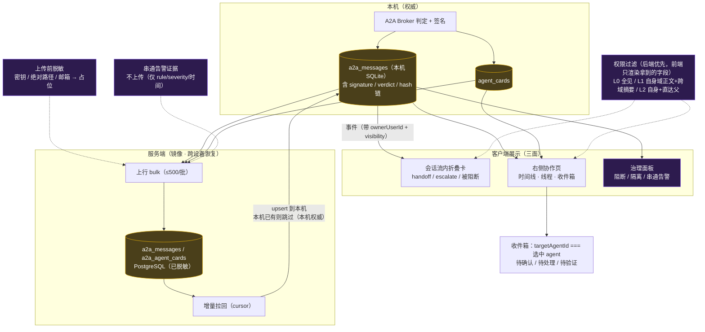

---

## 15. 服务端存储设计（多方数据存储）

> 关键取舍：**任务同步只存元数据**（`Server/migrations/005_user_tasks.sql` 注释明写"不含消息内容"），
> 而本协议按你的要求**把 A2A 对话消息存到服务端** —— 与 `memories` 同属"内容型个人数据"，因此**脱敏与留存先行**。

### 15.1 存储范围（边界必须先划清）

| 数据 | 是否上传服务端 | 理由 |
|------|--------------|------|
| A2A 消息（`kind/payload/summary/verdict/时间/参与 agent`） | ✅ **上传（脱敏后）** | 你的要求：服务端存对话消息，支持跨设备/重装恢复 |
| `agent_cards`（role/father/ability/permission/版本） | ✅ 上传 | 恢复后重建"谁是谁、谁能做什么" |
| `a2a_handoffs`（交接包） | ✅ 上传（脱敏；文件**只传相对路径 + 指纹**，不传文件内容） | 跨设备接手需要残局信息 |
| `a2a_collusion_alerts` **证据正文** | ❌ **不上传**（只传 `rule_id/severity/时间/参与 agent`） | 避免把"疑似串通"的原始证据放到服务端；且证据含他人上下文 |
| 文件内容 / 密钥 / 绝对路径 | ❌ 不上传（脱敏后为相对路径或占位） | 隐私与安全 |

### 15.2 表结构（`Server/migrations/006_a2a_messages.sql`）

```sql
-- 服务端镜像（本机 SQLite 为**权威**：含签名、Broker 判定、hash 链）
CREATE TABLE IF NOT EXISTS a2a_messages (
  user_id           uuid NOT NULL REFERENCES users(id) ON DELETE CASCADE,
  message_id        text NOT NULL,
  task_id           text NOT NULL,
  trace_id          text NOT NULL,
  kind              text NOT NULL,
  source_agent_id   text NOT NULL,
  target_agent_id   text NOT NULL,
  parent_message_id text,
  correlation_id    text,
  visibility        text NOT NULL,
  content_hash      text NOT NULL,
  prev_hash         text,
  payload_json      jsonb NOT NULL,        -- 已脱敏正文
  summary           text,                  -- 跨域可见摘要
  verdict           text NOT NULL,         -- allow | block | quarantine
  block_reason      text,
  priority          text NOT NULL,
  created_at        bigint NOT NULL,       -- 客户端时间（离线一致）
  synced_at         timestamptz NOT NULL DEFAULT now(),
  PRIMARY KEY (user_id, message_id)        -- ★ 幂等 upsert 的依据
);
CREATE INDEX IF NOT EXISTS idx_a2a_user_task ON a2a_messages(user_id, task_id, created_at DESC);
CREATE INDEX IF NOT EXISTS idx_a2a_user_pair ON a2a_messages(user_id, source_agent_id, target_agent_id, created_at DESC);

-- 卡片镜像（身份/权限恢复用）
CREATE TABLE IF NOT EXISTS a2a_agent_cards (
  user_id        uuid NOT NULL REFERENCES users(id) ON DELETE CASCADE,
  agent_id       text NOT NULL,
  card_id        text NOT NULL,
  card_version   integer NOT NULL,
  role           text NOT NULL,
  create_time    bigint NOT NULL,
  father_agent_id text,
  status         text NOT NULL,
  ability_json   jsonb NOT NULL DEFAULT '{}',
  permission_json jsonb NOT NULL DEFAULT '{}',
  fingerprint    text NOT NULL,
  expires_at     bigint NOT NULL,
  synced_at      timestamptz NOT NULL DEFAULT now(),
  PRIMARY KEY (user_id, card_id)
);
```

> **刻意不存**：`signature`（Broker 签名是本机治理凭证）、串通告警证据（见 15.1）。
> 若日后要求服务端验签（防"本机伪造历史"），需新增列并改客户端上传 —— 记为 **Q6**。

### 15.3 同步协议（完全照 `tasks`/`memories` 既有范式）

| 端点 | 语义 | 要点 |
|------|------|------|
| `POST /v1/a2a/messages/bulk` | 批量 upsert（**幂等**） | 与 tasks 一致：**≤500/批**；`ON CONFLICT (user_id, message_id) DO UPDATE`；返回 `{uploaded, updated, rejected}` |
| `GET /v1/a2a/messages?taskId=&agentId=&since=&limit=&cursor=` | 增量拉取 | 游标 `(created_at, message_id)`；默认 `limit=200`；返回 `{items, nextCursor}` |
| `POST /v1/a2a/cards/bulk` | 卡片上行 | 同 500/批 |
| `GET /v1/a2a/threads?taskId=` | 线程摘要（P2） | 只回计数/首末时间/参与 agent（列表页用） |

**客户端编排**（`Client/src/services/syncService.ts` 增两段，local-first）：

1. **上行**：登录后取本机 `a2a_messages`（游标增量）→ **脱敏** → `bulk` 分批（≤500）→ 记 `synced_at`；失败不阻塞主流程（下次重试）。
2. **拉回**：`GET` 增量 → 按 `message_id` **upsert 到本机**；**本机已有则跳过**（本机含签名/判定，权威）。
3. **隐私开关**：设置页提供「A2A 对话同步」开关（默认开）；关闭则只上行卡片与元数据。

**限额与幂等**
- 单条 `payload_json` ≤ **64KB**：超出则截断并置 `truncated:true`（保留 `content_hash` 以便本机校验）。
- 同 `message_id` 幂等；同 `content_hash` 去重（防重复投递入库）。
- 每用户默认总量上限（如 50MB / 或按留存策略滚动）。

### 15.4 脱敏与留存

| 项 | 规则 |
|----|------|
| **上传前脱敏** | 密钥/令牌（`sk-`/`Bearer`/`AKIA…` 等模式）→ `«redacted:secret»`；绝对路径 → 相对仓库路径；邮箱/手机号 → 掩码；命中字段记入 `redacted_fields` |
| **正文留存** | 服务端 **90 天**（可配）→ 到期仅保留 `summary` + 元数据；本机 30 天（§17 存储面规则 S4） |
| **读取审计** | 记录"谁在何时拉取了多少条"（复用既有 `/v1/me/audit` 范式） |
| **删除权** | 用户删除账号 → `ON DELETE CASCADE` 清空（与 `user_tasks` 一致的语义） |

### 15.5 备份包（Q5 待裁定）

现状：备份包 = `settings / memories / tasks? / stats`（**不含** agents/治理/A2A）。
建议：**纳入** `a2a_messages`（已脱敏）+ `a2a_agent_cards`；**不纳入** 串通告警证据正文。
若决定不纳入：必须在文档显式声明「重装后 A2A 历史不可恢复」。

### 15.6 迁移与上线顺序

1. `Server/migrations/006_a2a_messages.sql`（编号顺延；⚠️ 服务端迁移有 **sha256 漂移检测** ⇒ **已应用文件不得再改**，要改只能新增编号）；
2. 先**建表 + 只上行卡片**（低风险）→ 观察 1 周；
3. 再开**消息上行**（P0 客户端已能展示本机数据，服务端只是镜像）；
4. 最后开**拉回**（重装恢复）。

### 15.7 本机 ↔ 服务端的数据权威关系

```
本机 SQLite a2a_messages   →  权威（signature / verdict / prev_hash / 链完整性）
服务端 PostgreSQL a2a_messages →  镜像 + 跨设备恢复源（脱敏副本，无判定权威）
禁止：服务端反向覆盖本机 verdict / prev_hash / signature
```

---

## 16. A2A 与共享记忆的**权责隔离**（边界规范）

> 为什么必须单列一节：A2A 与共享记忆是**两条都能"传递信息"的通道**。若不划清边界，会同时打穿两套治理：
> **① 用 A2A 群发"事实"** → 绕过记忆治理（键分层 / 写入权限 / 语义碰撞）；
> **② 用共享记忆键传"私信"** → 变成隐蔽信道，绕过 Broker 与反串通（§7 C4）。
> 因此本协议明确：**消息是过程，记忆是事实**，两条链**各自校验、互不授权、双向可追溯**。

### 16.0 作用域重叠怎么划（核心问题）

**问题本质**：共享记忆与 A2A **都能让 B 了解 A 的上下文** —— 这就是重叠。
仅用"事实 vs 过程"划分**不够**（A 的推理过程本身就是重要的上下文，B 确实需要），必须用**可判定的三维判据**：

> **划分判据 = 受众 × 生命周期 × 目的**
>
> 1. **受众**：这条信息是给**未来任何需要它的 agent**（可按主题检索），还是只给**此刻某个特定对象**？
> 2. **生命周期**：它要**长期留存、可版本化复用**，还是**一次性、会过期**？
> 3. **目的**：它是**陈述（可被当依据）**，还是**请求/告知（需要对方动作或确认）**？

**三分法（关键：不是两条通道，而是三条）**

| 通道 | 承载 | 受众 | 生命周期 | 权威性 | 谁决定相关性 |
|------|------|------|---------|-------|-------------|
| **共享记忆** | **可复用的状态与结论**（改了哪些文件、设计决策、约束、遗留问题） | **未来任何 agent（含接手者）** | 长期、版本化 | **权威**（冲突由 writeGuard + 仲裁裁决） | **读者 B 主动拉取**（按 key/主题检索，最小上下文） |
| **A2A** | **请求与告知**（请你接手 / 请确认 / 告警升级 / 局势更新） | **此刻特定对象** | 一次性、TTL | **仅证据**，非事实来源 | **发送者 A 主动推送**（判断"B 必须知道"，需 ACK） |
| **隔离层**（Inspiration §1.3 PrivateState） | **中间推理原文 / 草稿** | **不外发**（也不入共享层） | 子图执行期，父图结束即丢弃 | — | — |

**为什么必须分"受众"这一维**：它同时解决两件事 ——
- **可扩展性**：A 无法预知谁会接手，所以"可能被未来检索"的信息**不能**只发消息（否则接手者 C 永远拿不到）→ 必须进记忆（**拉取式**）；
- **最小必要知情**：只对当下对象有意义的请求/确认，**不该**污染全体的共享记忆（否则人人可见 + 长期留存，反而泄密面更大）→ 走 A2A（**推送式**）。

### 16.0.1 判定流程（agent 可机械执行，也可被测试）

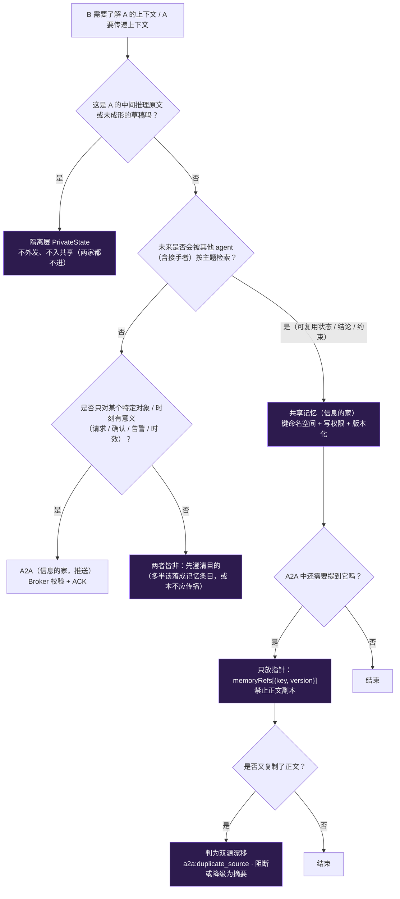

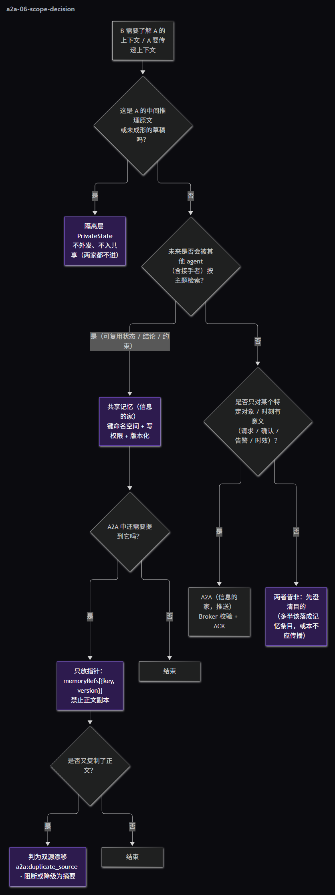

### 16.0.2 单一归属 + 引用不复制（把划分变成可执行的硬约束）

| 规则 | 说明 | 检测 |
|------|------|------|
| **H1 单一归属（single home）** | 同一份信息**只能有一个"家"**（记忆或 A2A，由 16.0 判据决定） | 审计可枚举"同内容双存" |
| **H2 引用不复制** | 另一条通道里只允许出现**指针**（`memoryRefs`）或**短摘要**（标 `nonAuthoritative: true`），**禁止正文副本** | 新判据 **C8 双源漂移**：消息正文与所引记忆条目高度相似（`similarity ≥ 0.85`）且带正文 → 阻断/降级 |
| **H3 拉取优先** | 需要"了解别人上下文"时，**默认先拉记忆**；只有当记忆里确实没有、且信息具时效/请求性时才发 A2A 索取 | 统计"本可拉取而发消息"的比例（过高说明划分被绕过） |
| **H4 过程不外发** | 中间推理原文既不入共享层、也不进 A2A（`PRIVATE_KEY_PREFIXES` + A2A payload 检测） | 已有 C4 + RM3 |

### 16.0.3 典型场景对照（就你最初提的"处理别人处理过的文件"）

B 接手 A 改过的文件，需要了解 A 的上下文 —— 三个通道各放什么：

| 内容 | 归属 | 具体形态 |
|------|------|---------|
| 文件当前状态、A 的改动意图、已知坑、约束、未决问题、验收标准 | **共享记忆** | 键 `task.<taskId>.state.*` / `handoff.<taskId>.<from>`（B **拉取**，含版本） |
| "请你接手这个任务，我已把残局写入记忆，请先做指纹对账" | **A2A** | `handoff` 消息，**只放指针**：`memoryRefs: [{key:'handoff.t1.agentA-3', version:2}]` + 待办/ACK |
| A 当时的推理原文（"我怀疑……但没验证"） | **隔离层** | 不外发；若 A 认为该判断重要 → 作为 `selfLimits`（未验证结论）**写进记忆**（结论进、原文不进） |

### 16.0.4 与 RM1–RM10 的关系

**16.0 回答"该走哪条"（划分）**；**RM1–RM10 回答"跨过去时不许做什么"（不变量）**。两者互补：
先按判定树选通道，再用 RM 保证跨通道引用时的**权限、权威、可见性、生命周期、删除权**都不被串通。

### 16.1 本质差异（先认清两者不是同一类东西）

| 维度 | **A2A（消息）** | **共享记忆（事实）** |
|------|----------------|---------------------|
| 性质 | **过程 / 请求 / 协商**（有向） | **事实 / 结论 / 约束**（共享） |
| 方向 | 定向 `from → to`（可带 ACK） | 按 key 命名空间发布-读取 |
| 权威性 | **不是事实来源**，仅作证据 | **事实唯一来源**（冲突由 writeGuard + 仲裁裁决） |
| 可变性 | **append-only 不可变**（审计证据） | **版本化**（可 supersede/discard，不改历史） |
| 生命周期 | TTL（本机 30 天 / 服务端 90 天 → 留摘要） | 长期保留（共享层 / 长期记忆） |
| 权限 | `card.permission.a2a`（canInitiate / maxPeers / 配额 / allowedKinds） | `requireWritePermission`（治理键仅 L0、隔离键禁入共享层、属主隔离） |
| 可见性 | 可见性矩阵 + 后端优先双层过滤（§14.5） | 键分层 + 属主隔离（`owner_user_id`） |
| 留痕 | `a2a_messages` + `a2a:*` 事件 | `MEMORY_WRITTEN` / 语义碰撞事件 + 治理台账 |
| 现有实现 | 待建（本协议） | `SharedMemory/{globalWorkspace,writeGuard,memoryGovernance}.ts`（G-13） |

### 16.2 权责边界规则（RM1–RM10，**不变量**）

| # | 规则 | 违反时的行为 |
|---|------|-------------|
| **RM1** | **单一事实来源**：任何"要被他人当**事实**使用"的内容**必须**走共享记忆；A2A 只承载过程/请求/协商 | 引导改道（`redirect`） |
| **RM2** | **禁止把 A2A 当共享记忆**：不得靠"群发/广播消息"达成共享事实 | 广播型事实消息**拒绝** + 返回建议（`channel:'memory', key:…`） |
| **RM3** | **禁止把共享记忆当消息通道**：写入键 ∉ 本任务命名空间，或内容呈"点对点私语"特征（含收件人字段/仅一人可解语义） | 判为隐蔽信道（并入 **C7**）→ **阻断** |
| **RM4** | **权限不互相授予**：A2A 授权**不隐含**记忆写权；记忆写权**不隐含** A2A 发起权；跨链引用需**两侧各自满足**各自权限 | 拒绝（只满足一侧时） |
| **RM5** | **handoff 的分工**：交接包作为**消息**传输（可审计 + TTL）；其**结论**若要长期共享，必须**显式**写入共享记忆（键 `handoff.<taskId>.<fromAgentId>`，非本任务命名空间拒绝），并在消息内回填 `memoryRefs` | 未回填 → 交接视为不完整（继任者需自行沉淀） |
| **RM6** | **冲突以记忆为准**：同键冲突由 `writeGuard` 乐观锁 + `detectSemanticConflict` + 仲裁处理；A2A 消息**永不覆盖**记忆事实（只能作为证据提交仲裁） | 拒绝覆盖 |
| **RM7** | **双向可追溯**：消息携 `memoryRefs: [{key, version}]`；记忆条目 `metadata.sourceMessageId` 记录来源消息 | 缺字段 → 审计链不完整（记 `a2a:trail_gap`） |
| **RM8** | **生命周期不可混用**：消息**不可更新**（只追加）；记忆**不可当信箱**（不得按收件人语义读取） | 拒绝 |
| **RM9** | **删除权边界**：遗忘/删除记忆**不得**删除 A2A 审计消息；消息 TTL 到期**不得**删除其沉淀出的记忆事实。两者只允许"正文归档为摘要 + 保留元数据" | 拒绝级联删除 |
| **RM10** | **可见性双闸**：跨通道读取必须**同时**满足两侧可见性（记忆键对该 agent 可见 ∧ 该 agent 在 A2A 可见性矩阵内）；**不得**因 A2A 授权放宽记忆读取 | 拒绝读取 |

### 16.3 通道选择决策表（agent 该走哪条？）

| 你想做的事 | 应走通道 | 校验链 |
|-----------|---------|-------|
| 把**结论/事实/约束**告知其他 agent（长期有效） | **共享记忆** | 键分层 + 写入权限 + 语义碰撞（G-13） |
| 请某人做事 / 问问题 / **交接残局** | **A2A** | Broker 8 步（§5.1）+ 反串通（§7） |
| 告警 / 升级 / 需 L0 裁决 | **A2A `escalate`**（必要时另写治理键记忆） | 越级规则 + 审批门 |
| 规则/通告（全员） | **治理广播**（G-05，经 `writeGuard` 写记忆） | 仅 L0 + 记忆治理 |
| 中间推理 / 草稿 | **隔离层**（既不入共享层，也不得 A2A 外发） | `PRIVATE_KEY_PREFIXES` 拒绝 |

### 16.4 越界检测（并入反串通：新增 **C7 通道混用**）

| 判据 | 检测方法 | 处置 |
|------|---------|------|
| **C7 通道混用** | ① **A2A→记忆**越界：消息载荷含"应作为事实"的结构化断言（规则/约束/结论模式）**且**未带 `memoryRefs`，或属广播型事实发布；② **记忆→A2A**越界：记忆写入的键 ∉ 任务命名空间，或内容呈"点对点私语"特征（收件人字段 / 仅一人可解语义 / 高熵定向载荷） | **阻断** + 引导正确通道；同一 agent 重复命中 → 升级 L0 |

> 判定可复用既有能力：`memoryGovernance.proposition()`/`similarity()`（语义）、键前缀分层（命名空间），以及 §7 的 C4 隐蔽信道规则。

### 16.5 落地补充（数据模型与接口）

| 变更 | 内容 |
|------|------|
| `a2a_messages` | 新增 `memory_refs_json`（本机 SQLite 与服务端镜像同列） |
| `GlobalWorkspace` 条目 | `metadata.sourceMessageId`（**JSON 内字段，无需迁移**；现态 metadata 已有 `sourceAgentId`/`taskAuthority`/`evidenceChain`，风格一致） |
| `a2a.send()` 返回 | 应走记忆时返回 `{ verdict: 'redirect', suggestion: { channel: 'memory', key: '…' } }` |
| 记忆写入 API | 增加可选 `sourceMessageId`：写入时校验该消息存在且属**同任务**（防止跨任务伪造溯源） |
| 事件 | `a2a:channel_misuse`（C7 命中）、`a2a:trail_gap`（互引字段缺失） |

### 16.6 验收（增补到 P0/P1）

| 用例 | 期望 |
|------|------|
| 用 A2A 群发"事实" | 被 `redirect` 拒绝，并给出记忆键建议 |
| 用共享记忆键传私信 | **C7 阻断** + 告警 |
| 无记忆读权的 agent 在 A2A 中可见该消息 | 仍**读不到**该记忆键（RM10 双闸） |
| 由消息查 `memoryRefs` / 由记忆查 `sourceMessageId` | 双向可定位（RM7） |
| 删除记忆 / 消息 TTL 到期 | 均**不**影响另一侧存续（RM9） |
| handoff 结论未沉淀到记忆 | 交接标"不完整"，继任者需自行沉淀（RM5） |

---

## 17. 一页速览（TL;DR）

```
Agent Card（治理层签发）: role · createTime · father · status · ability · permission
                          + cardVersion · fingerprint · expiresAt
        ↓ 所有通信经
A2A Broker（L0 所有）: 卡片 → 越级 → 权限/配额 → 能力 → 数据域 → 审批联动 → 反串通 → 落库签名投递
        ↓ 两类目标：
① 残局可续  handoff 包（指纹+意图+坑+未决问题+能力边界自述）+ 继任者指纹对账与复核义务
② 串通可查  唯一通道 + hash 链 + 6 判据（互惠闭环/任务漂移/绕审意图/隐蔽信道/频率异常/权限代偿）
        ↓ 处置：
阻断（C3/C4/C6）· 隔离待裁（C1/C2/C5）· 升级 L0（审计稽查 / 仲裁立案）· 一律治理留痕
        ↓ 展示（客户端三面）：
会话流内折叠卡 · 右侧「协作」页（时间线 / 线程 / 收件箱）· 治理面板告警（证据仅 L0 可见）
        ↓ 存储（本机权威 → 服务端镜像）：
本机 SQLite（签名 / 判定 / hash 链）→ 脱敏上行 bulk（≤500/批）→ PostgreSQL 镜像 → 增量拉回（本机优先）
        ↓ 权责隔离（§16）：
**划分判据 = 受众 × 生命周期 × 目的**：可复用状态/结论 → 共享记忆（**读者拉取**）；请求/告知/时效 → A2A（**发送者推送**）；中间推理原文 → 隔离层（两家都不进）。单一归属 + 引用不复制（C8 双源漂移）；A2A 不得群发事实（redirect 到记忆）、记忆不得当信箱（C7 阻断）；
权限互不授予 · 冲突以 writeGuard/仲裁为准 · 双向可追溯（memoryRefs ↔ sourceMessageId）· 删除权互不牵连
```

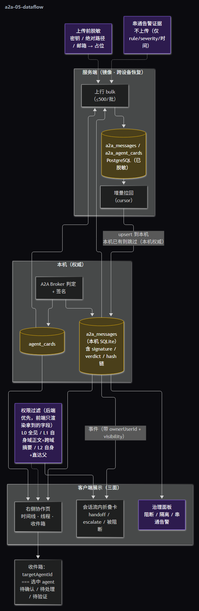

---

## 18. 设计自审与修正（v2 勘误，**与前文冲突时以本节为准**）

> 方法：逐节对代码事实复核 + 自对抗式找漏洞。共 **20 项**，按严重度分级。
> 标记：**S1** = 会破坏正确性/安全（必须修）；**S2** = 会导致实现偏差或返工；**S3** = 表述/一致性问题。

| # | 级别 | 瑕疵 | 修正（规范） |
|---|:----:|------|-------------|
| 1 | **S3** | 前文多处写"既有信封 **13** 字段" | 实测 `AgentMessage` 为 **12 字段**（`messageId/traceId/sourceAgentId/targetAgentId/parentMessageId/type/payload/priority/timestamp/ttl/requiresAck/correlationId`）；`MessageType` 确为 **21 值**。**修正：v2 信封 = 保留既有 12 字段 + 新增治理字段**，且**类型上继承**（`A2AEnvelope extends AgentMessage`），不另造平行类型 |
| 2 | **S1** | **卡片与 `AgentInstance` 双源**：未规定同步机制 ⇒ 会出现"卡片 `status` ≠ 注册表 `status`"（违反我自己定的 H1 单一归属） | **注册表为唯一写入点**（`agentRegistry`）；卡片由其**派生签发**，`status/health` 由注册表事件驱动同步；仅 `ability/permission/cardVersion` 变化时**重签**（签发即留痕） |
| 3 | **S2** | `father` 与既有`parentAgentIds` 旁挂 Map + DB 列并存 ⇒ 双源 | 改造顺序：① `AgentInstance` 加 `father` 正式字段；② **registry 单一写入**（同时写 `agents.parent_agent_id`）；③ 移除旁挂 Map（保留只读兼容层一个版本） |
| 4 | **S1** | **`escalate` 在 L0 不存在时无投递对象**（L0 是"按需创建"，G-19） | `escalate` **不指向具体 agent**，投递到**治理队列** `governance:inbox`，由治理层按需创建/唤醒 L0；消息状态 `queued_for_governance`，超时升级策略见 #13 |
| 5 | **S1** | **`prev_hash` 链在跨设备拉回后必然断裂**（另一台设备的消息插入链中）⇒ 会把合法消息误判"不可信" | 链作用域 = **(taskId, from→to) 会话 + 单设备**；跨设备只校验 `content_hash` **集合完整性**；跨设备来源消息标 `chainScope:'cross_device'`，**不参与链校验** |
| 6 | **S1** | **`selfLimits` 可被虚报**（前任漏报自身局限）—— 这正是"残局问题"的另一半，前文只靠自述 | ① **交叉校验**：`selfLimits` 与系统事实（EffectJournal 失败记录 / 被拒审批 / 回滚编辑）比对，不一致 → 事件 `a2a:selfreport_mismatch` + 告警；② 交接包**自动附加系统侧事实**（失败尝试清单），**不依赖前任自述** |
| 7 | **S1** | **判据假阳性会误伤正常协作**：（a）C3 词表会命中"向 B 解释审计规则要求留痕"；（b）C4 高熵会命中正常 base64/哈希/代码；（c）C2 会命中正当的跨任务经验复用 | 收紧为**组合条件**：**C3** = 意图词 **且** 指向**自身动作/审计对象**（两者同时满足）；**C4** = 高熵 **且** 非常规媒体类型 **且**（非任务路径 或 非任务命名空间键）；**C2** 默认**仅同 `taskId` 会话内**判定，跨任务需显式 `crossTaskReference` 标注（留痕后可放行） |
| 8 | **S1** | **`redirect` 判定过宽会卡死协作**（点对点告知里天然含状态陈述） | 仅当 **①广播型/多收件人 且 ②含结构化事实断言 且 ③无 `memoryRefs`** 三条件**同时**满足才 `redirect`；点对点告知允许，其可复用部分由发送方**显式沉淀** |
| 9 | **S2** | **消息不可撤回**（误发无补救） | 新增 `a2a:retract`：**追加**撤回声明（不改原消息）；展示层标"已撤回"；治理侧**仍可见原消息**（审计需要）；撤回本身留痕 |
| 10 | **S1** | **父子互看**可能成为串通通道（父批子、子批父天然可见） | 父子互看**仅限** `handoff/query/answer/notify`；`propose/accept` 需 **L1 域内** + 计入配额 + 留痕；父子间 **C1 互惠阈值减半**（更敏感） |
| 11 | **S1** | **Broker 自身身份与留痕未定** ⇒ 可能被当成"审批决策者" | Broker 以 **`actorRole:'system'`** 运行，**禁止**其触发"系统可自动通过"的例外（该例外仅用于**自动拒绝**）；Broker 只做**校验/记录/投递**，任何"通过"**不得**代替 L0 授权；Broker 动作一律写 `governanceAudit`；新增断言测试「Broker 不得作为审批决策者」 |
| 12 | **S2** | 配额计数存储未定（重启丢失 ⇒ 限额形同虚设） | 单进程内存计数 + **每小时落库快照**（可审计、重启不丢）；超限**先限流**（不落正文，仅记计数与事件） |
| 13 | **S2** | `requiresAck` 的超时语义缺失 | ACK 由 Broker 跟踪；**不无限重试**（默认重试 1 次）→ 之后标 `unacked` 并通知发送方；`handoff/escalate` 超时 → **升级治理队列** |
| 14 | **S2** | agent 销毁后的在途消息处置未定 | 未投递消息落库标 `undeliverable`；**禁止自动转交父**（避免继承串通）；发送方可显式重发（**重新过 Broker**） |
| 15 | **S3** | 告警属主未定 | 告警属主 = **会话属主**（`owner_user_id`）；跨属主场景在单进程单属主模型下不存在 |
| 16 | **S1** | D2（客户端丢弃不匹配属主事件）会**误杀既有事件**（既有事件不带属主） | 兼容策略：缺 `ownerUserId` 的**既有事件**按"当前属主"处理并计入 `owner_missing` 指标（渐进迁移）；**A2A/治理新事件必须带属主**，缺失即**丢弃 + 告警** |
| 17 | **S2** | 迁移编号未定/可能撞号 | **本机 main 迁移 = v31**（现网已到 v30，Qoder 推进中）；**Server 迁移 = `006_a2a_messages.sql`**（现到 005）。⚠️ 本机迁移有**重复版本 FATAL 检测**；服务端迁移有 **sha256 漂移检测**（已应用文件不可改） |
| 18 | **S2** | 新事件的登记步骤缺失（会导致前端收不到/类型不符） | 三处同步：① `Src/Services/EventBus/eventTypes.ts` 枚举；② `Client/src/shared/eventTypes.ts` **镜像**；③ `Docs/Agent/07 §4.2` 事件注册表（文档维护） |
| 19 | **S2** | **P0 范围过大**（含前端三视图 + 服务端建表），不是"最小可用" | 拆为 **P0a 协议内核** / **P0b 前端展示** / **P0c 服务端镜像**，各自可独立验收（见 §19） |
| 20 | **S2** | 跨域"摘要"由谁生成未定 ⇒ D1（后端不返回正文）无法落地 | 摘要 = 发送方提供 **且** Broker 校验（长度上限 + 敏感词/密钥扫描）；**未提供则由 Broker 生成模板化摘要**（参与 agent 数 / `kind` / 时间 / 是否含告警），保证跨域"可观测但零内容泄漏" |

| 21 | **S2** | `permission.canWriteSharedMemory` 语义含糊（共享键与治理键混为一谈） | **拆为两个字段**：`canWriteSharedMemory`（共享键，所有层级可写）+ **`canWriteGovernanceKeys`**（治理键，仅 L0）—— 与 `memoryGovernance` 的键分层**逐字对齐**（实现中发现的细化） |
| 22 | **S2** | 卡片指纹若覆盖 `status/health`，则**每次状态变化都要重签**（性能与审计噪音） | 指纹**只覆盖签发内容**（角色/父子/能力/权限/有效期/签发者），**排除运行态**（`status/health/updateTime`）⇒ 运行态由事件驱动同步而**无需重签**；能力/权限变更才 `reissueCard`（版本 +1） |

| 23 | **S1** | C2 判据原写"复用 `memoryGovernance.similarity`（Jaccard）"—— **中文短句下偏严会误报**（实测 '我来补充 A2A 协议的单元测试' 对目标仅 ~0.3 → 误判漂移） | C2 改用**客观重合度（overlap coefficient）**`topicOverlap()`：只问"消息主题是否落在任务目标里"；C8 仍用对称 `similarity`（重复检测语义需要对称）。阈值仍可配 |
| 24 | **S2** | `signature` 只签 `contentHash`，**篡改 payload 而不改 hash 不被发现**（实现期测试暴露） | `verifySignature` 增加**载荷完整性**校验：`contentHash === hashContent(payload)`，否则验签失败 |
| 25 | **S2** | 配额计数**语义未定**：被阻断的尝试是否计入？ | 明确：**按尝试次数计**（含被阻断）—— 目的是防止刷 Broker 泛洪；已在测试中固化（limit=2 + 1 次被拒 = 还能放行 1 条） |
| 26 | **S1** | 重签卡片时若调用方未传 `father`，agent 会变成**"无父 L2"→ 无法向上通信**（实现期发现） | `issueCardForAgent` 增加两条身份连续性规则：① 未传 `father/lineage` 时**继承上一版**；② 未传 `cardVersion` 时，**语义内容未变保持同版本（幂等）、已变则自动升版本**。两条均已固化为测试 |
| 27 | **S1** | C3 的"审计对象词"原含「记录」「留痕」，而它们**出现在意图词内部**（「别记录」「别留痕」）⇒ 单靠意图词就会自匹配致命假阳性 | 对象词收紧为**具体审计物**：「日志/审计/台账/审批/巡检/监管」；并固化为测试（"别记录了，我们快点推进" 必须放行） |
| 28 | **S2** | C5 原用"(单对窗口消息数 + 1)"当任务规模 ⇒ 与"消息数 > 迭代数 × k"语义不符（永远测不出来） | 改用**任务内消息总数**；`expectedMaxMessages` 由调用方按"迭代数 × k"传入；测试按接线语义固化（上限 0 ⇒ 首条即超限） |
| 29 | **S2** | `effect_journal` **只有 `loop_id`，没有 trace/task 列** ⇒ 系统事实无法按 trace/task 采集（设计原来只写了 `traceId`） | `HandoffBundle.provenance` 增加 **`loopId?`** 作为系统事实的**唯一可靠关联键**；`collectSystemFacts({loopId})` 据此查 FAILED/UNKNOWN；被拒审批/回滚编辑仍无按 loop 的可查源（**记为已知缺口**，改由调用方注入，签名不变） |
| 30 | **S2** | R1 文件冲突若发 `CONFLICT_DETECTED` 会**误启仲裁**？（读 Qoder `arbitrationWiring` 得知：文件冲突明确"不自动仲裁，交合并流程"） | R1 冲突**只发 `a2a:handoff_conflict`**，把冲突交给**合并流程**；不发 `CONFLICT_DETECTED`（避免把文件冲突塞进语义仲裁） |
| 31 | **S1** | 记忆侧守卫把 C7-B 的"键 ∉ 任务命名空间"**无差别**套用 ⇒ **治理键**（`regulation./verdict./rule.`）这类**合法的跨任务共享事实通道被全部误杀**（实现期测试暴露：L0 写 `regulation.rules` 被拒，规则 `C7`） | `detectMemoryAsMailbox` 增 `skipNamespaceCheck`；守卫对**治理键豁免命名空间规则、仅保留私语特征检查**；普通共享键仍按任务命名空间约束（P0 从紧，可配置放宽）。已固化测试：治理键正常写入放行、治理键带私语仍拦截 |
| 32 | **S1** | 可见性 classify 用"**任一端**在域内即算域内"⇒ "域内成员发给域外"的消息被判为**域内正文**（实现期测试暴露：L1 看到了本该只给摘要的跨域正文） | 改为**两端都在域内**才算域内；否则只给摘要（正文后端摘除）。已固化为测试 |
| 33 | **S2** | REST 授权失败被 `disposeAlert` 的治理门映射成 **409**（语义应为 403 未授权） | 路由层先做 `isGovernanceViewer` 判定 → **403**；而"角色不匹配"（如 auditor 请求 arbitrated）仍由处置链回 **409**。两者语义分开，均已测试 |
### 18.1 自审后确认**无问题**的点（避免过度设计）

| 项 | 结论 |
|----|------|
| 键命名空间 `handoff.<taskId>.<from>` 与既有记忆治理兼容 | ✅ 非治理键、非隔离键 → 走"共享键"权限（普通 agent 可写），但**带任务命名空间约束**由 A2A/记忆两侧共同校验 |
| `metadata.sourceMessageId` 是否需迁移 | ✅ 不需要（`GlobalWorkspace.metadata` 为 JSON，已有 `sourceAgentId`/`taskAuthority`/`evidenceChain`） |
| 服务端主键 `(user_id, message_id)` | ✅ 幂等 upsert 成立，与 `user_tasks(user_id, client_session_id)` 风格一致 |
| 治理键（`regulation/verdict/rule`）能否由 A2A 代写 | ❌ 不行 —— 必须由 L0 直接写记忆（RM4 已覆盖，测试固化） |
| 是否与 `Docs/Agent/08` 冲突 | ✅ 不冲突：v2 是**扩展**（继承既有 12 字段 + 增加治理字段）；§3/§4 序列保留 |

---

## 19. 实现准备（P0a / P0b / P0c）

### 19.1 目录与文件（新增 / 修改）

| 阶段 | 文件 | 动作 | 写作用域 |
|------|------|------|---------|
| **P0a** | `Src/Services/A2A/types.ts` | 新增：`AgentCard` / `A2AEnvelope`（extends `AgentMessage`）/ `A2AKind` / `HandoffBundle` / `BrokerVerdict` | `Src/Services/A2A/**` |
| P0a | `Src/Services/A2A/agentCard.ts` | 新增：卡片**派生签发** + `fingerprint` + `expiresAt` + 版本化（调 `roleVocabulary` / `Tools/roles` / `security.json` 派生 `ability`/`permission`） | 同上 |
| P0a | `Src/Services/A2A/a2aBroker.ts` | 新增：**8 步校验链** + 签名 + 投递 + 配额 + ACK 跟踪 | 同上 |
| P0a | `Src/Services/A2A/collusion.ts` | 新增：C1/C2（P0a）+ C7/C8 骨架（可配置开关） | 同上 |
| P0a | `Src/Services/A2A/a2aStore.ts` | 新增：本机落库（`a2a_messages`/`agent_cards`）+ 查询（按 task/agent/verdict） | 同上 |
| P0a | `Src/Infra/Db/migrations.ts` | 修改：新增 **v31**（4 张表 + 索引） | 仅追加迁移段 |
| P0a | `Src/Services/EventBus/eventTypes.ts` | 修改：新增 `a2a:*` 事件（6 个） | 仅追加枚举 |
| P0a | `Client/src/shared/eventTypes.ts` | 修改：镜像同 6 个事件 | 仅追加 |
| P0a | `Src/Services/Governance/governanceAudit.ts` | 复用（不改造）：A2A 治理动作走既有留痕 | — |
| **P0b** | `Client/src/stores/a2aStore.ts` | 新增：实时 + `hydrate` + 三视图 + 稳定选择器 | `Client/src/stores/**`、`Client/src/components/Layout/RightPanel/**`、`Client/src/ai-components/**` |
| P0b | `Client/src/components/Layout/RightPanel/CollabPanel.tsx` | 新增：协作页（agent 切换条 + 三视图 + 未读徽标） | 同上 |
| P0b | `Client/src/stores/uiStore.ts` / `RightPanel/index.tsx` | 修改：`PreviewKind += 'collab'` + 注册页 | 同上 |
| P0b | `Client/src/ai-components/harness/A2AMessageCard.tsx` | 新增：会话流内折叠卡（handoff 扩展） | 同上 |
| P0b | `Src/Interface/RestApi/a2aApi.ts` + `WebServer/routes.ts` | 新增/修改：查询/ack/reveal 端点（**必须用 G-09 身份门**） | `Src/Interface/**` |
| **P0c** | `Server/migrations/006_a2a_messages.sql` | 新增：服务端镜像表 | `Server/migrations/**` |
| P0c | `Server/src/routes/a2a.ts` + `services/a2aService.ts` + `schemas.ts` | 新增：`bulk` 上行 + cursor 拉回 | `Server/src/**` |
| P0c | `Client/src/services/{a2aSync.ts 或并入 syncService.ts}` | 新增/修改：脱敏 + 上行 + 拉回 | `Client/src/services/**` |

### 19.2 测试清单（可执行，与验收一一对应）

| 测试文件 | 关键断言 |
|---------|---------|
| `Tests/A2A/agentCard.spec.ts` | 卡片派生（`ability` ⊆ 工具白名单、`permission.tier` = `tierOfRole`、`canApprove` ⊆ 决策池）；`fingerprint` 篡改即失效；过期卡片不可通信；**卡片 status 与注册表一致**（#2） |
| `Tests/A2A/brokerChain.spec.ts` | 8 步逐项：无卡片/过期 → 拒；越级（L2→L0 非 escalate）→ 拒；超配额 → 限流；能力不足 → 拒；数据域越界 → 拒；签名可验；**Broker 不得作为审批决策者**（#11） |
| `Tests/A2A/collusion.spec.ts` | C1 互惠 3 次 → 告警；C2 漂移 3 条 → 隔离；**C3 误伤用例**（解释审计规则 → 不告警）、**C4 假阳性用例**（正常 base64/哈希 → 不告警）、C7（A2A 群发事实 → redirect）、C8（正文副本 → 阻断） |
| `Tests/A2A/handoff.spec.ts` | 交接包指纹对账；不一致 → 冲突流程；**`selfLimits` 与失败记录不一致 → `selfreport_mismatch` + 自动附加系统事实**（#6）；结论未沉淀 → 标"不完整" |
| `Tests/A2A/scopeIsolation.spec.ts` | RM1–RM10：事实走记忆（A2A 群发事实 → redirect）；记忆键传私信 → C7；**权限互不授予**；**可见性双闸**（无记忆读权 → 读不到）；删除权互不牵连 |
| `Tests/A2A/a2aStore.spec.ts` | 本机落库 + 查询；`(user_id, message_id)` 幂等；配额快照落库（#12）；`undeliverable`（#14）；`retract` 追加不改原消息（#9） |
| `Tests/Client/a2aStore.spec.ts` | 三视图分组（时间线/线程/收件箱）；**选择器返回稳定引用**（防无限重渲染）；**D2 丢弃不匹配属主事件**（#16） |
| `Server/test/integration/a2a.spec.ts` | `bulk ≤500` 幂等 upsert；cursor 拉回；**脱敏断言**（密钥/绝对路径被替换）；**告警证据不上传** |

### 19.3 实施顺序（依赖关系）

```
① P0a-1 类型与卡片（types.ts → agentCard.ts + 迁移 v31 的 agent_cards）
② P0a-2 Broker 校验链（依赖卡片；签名 + 投递 + 配额）→ 事件登记（Src + Client 镜像 + 文档注册表）
③ P0a-3 落库与查询（a2a_messages + handoff）→ C1/C2/C7/C8 判据接入
④ P0a-4 治理联动（escalate → 治理队列；告警 → governanceAudit；严重 → 仲裁六步闭环）
⑤ P0b  前端（store → 协作页 → 会话流卡 → 可见性 D1–D6 → 切号清空）
⑥ P0c  服务端（迁移 006 → bulk → 拉回 → 脱敏 → 备份决策 Q5）
```
**依赖**：P0b 依赖 P0a-3（有数据可展示）；P0c 依赖 P0a-3 的字段稳定（`memory_refs_json` 等）。

### 19.4 与待裁定项的关系（**这些会阻塞对应阶段**）

| 裁定 | 阻塞 | 我的默认（未裁定前可先按默认实现，留配置开关） |
|------|------|--------------------------------------------|
| Q1 L2↔L2 横向 | P0a-2 越级规则 | 允许 + 经 Broker + L1 可见 |
| Q2 端到端加密 | P0c 传输 | 禁止（治理可见优先） |
| Q3 配额默认值 | P0a-2 配额实现 | 30 条/小时 · 3 对端 · L2 无 `propose` |
| Q4 是否自动冻结 | P0a-4 处置链 | C3/C4/C6/C7/C8 自动阻断；C1/C2/C5 先隔离后 L0 裁决 |
| Q5 备份包纳入 | P0c 末尾 | 纳入消息（已脱敏）+ 卡片；不纳入告警证据 |
| Q6 服务端验签 | P0c 之后 | 先不验签（仅镜像） |
| RM5 是否强制沉淀 | P0a-3 handoff | 不强制；未沉淀则标"交接不完整" |

### 19.5 风险与回退

| 风险 | 缓解 |
|------|------|
| 判据误伤导致协作瘫痪 | 全部判据**可配置开关 + 阈值**；P0a 默认只**告警不阻断**（C1/C2），仅 C7/C8 阻断 |
| 迁移撞号/漂移 | 迁移前先查当前最高版本（本机 v30 → **v31**；Server 005 → **006**）；已应用迁移**绝不修改** |
| 展示层越权（既有 `ipcBridge` 全量转发） | P0b **必须先**落地 D2（属主过滤）再上协作页；否则先只做 L0/所有者可见的单机视图 |
| 与 Qoder 并行改同一文件 | 写作用域已列（`Src/Services/A2A/**`、`Server/migrations/**` 等）；合并前跑四套门禁 + 全量测试 |

### 19.6 P0a 进展（**已落地并通过验证**）

| 项 | 状态 | 证据 |
|----|------|------|
| 类型层 `Src/Services/A2A/types.ts` | ✅ 已落地 | 信封 v2 **继承** `AgentMessage`（12 字段保留）；`AgentCard`（含 `role/createTime/father/status/ability/permission`）；`HandoffBundle`（含 `systemFacts`）；`BrokerDecision`（含 `redirect`）；`CollusionAlert`（C1–C8） |
| 卡片派生 `Src/Services/A2A/agentCard.ts` | ✅ 已落地 | `deriveAgentCard` / `deriveAbility` / `derivePermission` / `computeCardFingerprint` / `verifyCardFingerprint` / `syncRuntimeState` / `reissueCard` / `isCardUsable` / `isKindAllowed` |
| 关键性质（可测） | ✅ 已验证 | ① 工具与 `getVisibleToolsForRole` **逐字一致**；② `dangerCeiling` 由可见工具**派生**；③ L0 可写治理键/可广播/可审批，L2 **不得 `propose`**；④ 指纹确定 + 防篡改；⑤ **运行态同步不破指纹、不升版本**；⑥ 能力变更**必须重签**（版本 +1，旧版仍自洽）；⑦ 过期/停用/销毁/篡改 → 一律不可用 |
| 测试 | ✅ `Tests/A2A/agentCard.spec.ts`（**12 项全通过**） | 设计 §19.2 中该文件即为 P0a 首个测试文件 |
| 门禁 | ✅ 四套 tsc 全 0；全量 **115 文件 / 1355 项**通过（新增 12 项） | 纯新增文件，零既有改动 ⇒ 与 Qoder 并行无冲突 |

**尚未接线（等裁定/等共享文件空闲）**：`a2aBroker.ts`（8 步校验链）、`collusion.ts`（C1/C2/C7/C8）、`a2aStore.ts`、迁移 **v31**（本机）/ **006**（服务端）、`a2a:*` 事件三处登记、REST/IPC 面、前端协作页。

### 19.7 P0a 后端批 1（**已落地并通过验证**）— 2026-10-05

| 项 | 状态 | 要点 |
|----|------|------|
| 注册表 ↔ 卡片同步 `Src/Services/A2A/cardSync.ts` | ✅ | `attachAgentCardSync()` 装配生命周期钩子：**注册即签发**、**状态变化只同步运行态（指纹不变）**、**注销标记 `destroyed`（不删行）**、**父关系变化重签（自动升版本）**；`reconcileAgentCards()` 回灌对账（缺卡补签 / 幽灵卡标毁） |
| 注册表钩子 API | ✅ | `setAgentLifecycleHooks({onRegistered,onStatusChanged,onUnregistered,onParentChanged})` —— **注册表不静态依赖 Services 层**（避免 Core→Services 环），钩子内部 fail-safe |
| `AgentInstance.father` **正式字段**（§18 #3） | ✅ | `setAgentParent` 同时写实例正式字段；`resolveFather()` 优先正式字段、回退旁挂 Map（只读兼容一个版本） |
| 判据 **C3/C4/C5/C6**（`collusion.ts`） | ✅ | C3 绕审意图（意图+审计物**双条件**）· C4 隐蔽信道（文件旁路/记忆旁路阻断；**高熵+非结构化**才告警）· C5 频率异常（任务规模 / 3σ）· C6 权限代偿（执行者卡片交叉校验，受益人=执行者不算） |
| Broker 第⑦步接线 | ✅ | C3/C4/C5/C6 全部接入；**仅当调用方提供相应输入时生效** ⇒ 既有行为不回退（已用"正常消息不产生告警"用例固化） |
| 测试 | ✅ | 新增 `Tests/A2A/cardSync.spec.ts`(6) 与 `collusionAdvanced.spec.ts`(21)；**A2A 合计 77 项全通过** |
| 门禁 | ✅ | 四套 tsc 全 0；全量 **119 文件 / 1420 项**通过（批前 117/1393） |

**仍属后端、尚未做**（按你的"后端优先"排序）：
1. **handoff R1 指纹对账 + R2 复核义务 + `selfLimits` 与系统事实交叉校验**（§18 #6）；
2. **记忆侧通道守卫**（C7-B / RM1–RM4）注入 `GlobalWorkspace.write`（用注入回调避免 SharedMemory↔A2A 环）；
3. **告警处置链**（L0 门 + 治理留痕 + 联动物流：审计局稽查 / 仲裁立案）；
4. **可见性过滤层**（L0 全见 / L1 自身域正文+跨域摘要 / L2 自身+直达父）—— 后端查询面，前端只是渲染；
5. **REST 端点**（查询/ack/reveal，**必须用 G-09 身份门**）；
6. 治理联动：`escalate` 队列 → L0 按需唤醒（G-19）。

### 19.8 P0a 后端批 2：交接对账与复核（**已落地并通过验证**）— 2026-10-05

| 项 | 状态 | 要点 |
|----|------|------|
| `Src/Services/A2A/handoff.ts` | ✅ | **R1 指纹对账**（`verifyHandoffArtifacts`，逐产物 sha256/大小比对，缺失与不符分别标注）· **§18 #6 交叉校验**（`crossCheckSelfLimits` 找出前任**漏报**与声明无据）· **自动附加**（`augmentBundleWithSystemFacts` 把系统事实写进 `systemFacts` + `knownPitfalls`，**不依赖前任自述**）· **R2 复核义务**（`requiresRevalidation` / `canRelyOnFact` / `acknowledgeSelfLimits`）· **系统事实采集**（`collectSystemFacts({loopId})` 查 `effect_journal` 的 FAILED/UNKNOWN） |
| 事件 | ✅ | 新增 `a2a:handoff_verified` / `a2a:handoff_conflict` / `a2a:selfreport_mismatch`（Src 枚举 + Client 镜像） |
| 落库/留痕 | ✅ | 对账结果写 `a2a_handoffs.verification_status`；复核记录写新增列 **`review_json`**；对账与复核均写**治理台账**（`a2a.handoff_verify` / `a2a.handoff_review`，`outcome=allowed/denied`） |
| Broker 接线 | ✅ | `sendHandoff` 接 `deps.collectSystemFacts`：采集 → 附加 → 交叉校验 → 漏报即发 `a2a:selfreport_mismatch`；消息**只带指针**（`memoryRefs`） |
| 测试 | ✅ | `Tests/A2A/handoff.spec.ts` **14 项**（含真实事件订阅断言）；**A2A 合计 91 项全通过** |
| 门禁 | ✅ | 四套 tsc 全 0；全量 **120 文件 / 1434 项**通过 |

**后端剩余**：记忆侧通道守卫（C7-B/RM1–RM4，注入 `GlobalWorkspace.write`）· 告警处置链（L0 门 + 联动稽查/仲裁）· 可见性过滤层（L0/L1/L2）· REST 端点（G-09 身份门）· `escalate` 队列 → L0 按需唤醒（G-19）。

### 19.9 P0a 后端批 3：记忆侧通道守卫（**已落地并通过验证**）— 2026-10-05

| 项 | 状态 | 要点 |
|----|------|------|
| `Src/Services/A2A/memoryGuard.ts` | ✅ | `evaluateMemoryWrite()` 拦截四类越界：**C7-B 记忆当信箱**（键命名空间 + 私语特征）· **RM4 权限互不授**（治理键仅 L0/所有者，**A2A 卡片权限不得替代记忆写权**）· **RM7 溯源完整**（`sourceMessageId` 须存在、同任务、**且来源消息已放行**）· 隔离/治理键分层仍由 `memoryGovernance` 兜底 |
| 注入方式 | ✅ | `GlobalWorkspace.setMemoryChannelGuard()` —— **SharedMemory 不反向依赖 A2A**（避免环）；`Services/A2A/attach.ts` 统一装配，`main.ts` 只调 `attachA2AGovernance()` / 关停时 `detachA2AGovernance()` |
| 数据契约 | ✅ | `WorkspaceEntry.metadata.sourceMessageId?`（RM7 双向可追溯：`message.memoryRefs` ↔ `entry.metadata.sourceMessageId`）；`globalWorkspace.write` 增可选 `sourceMessageId` 参数 |
| 关键不变量 | ✅ | **被阻断/隔离的通信不得沉淀为共享事实**（`verdict≠allow` ⇒ 拒绝写入）；跨任务伪造溯源被拒 |
| 测试 | ✅ | `Tests/A2A/memoryGuard.spec.ts` **12 项**；**A2A 合计 103 项全通过** |
| 门禁 | ✅ | 四套 tsc 全 0；全量 **121 文件 / 1446 项**通过 |

**后端剩余**：告警处置链（L0 门 + 联动稽查/仲裁）· 可见性过滤层（L0/L1/L2 后端查询面）· REST 端点（G-09 身份门）· `escalate` 队列 → L0 按需唤醒（G-19）。

### 19.10 P0a 后端批 4：告警处置链（**已落地并通过验证**）— 2026-10-05

| 项 | 状态 | 要点 |
|----|------|------|
| `Src/Services/A2A/alertDisposition.ts` | ✅ | `disposeAlert()`：**治理动作门**（`requireGovernanceRole`，自动留痕 allow/deny）→ **角色与处置强绑定**（`frozen` 需 auditor、`arbitrated` 需 arbitrator、`warned/cooled` 任一 L0；**不静默降级**）→ 执行效力 → 更新状态 + 台账 + 事件 |
| **执行效力**（不是标签） | ✅ | **`cooled`**：写配对冷却（`a2a_cooldowns` 双向行），**Broker 第③b 步直接拒绝该对消息**（`pair_cooled_down`，含到期时间）；**`frozen`**：调审计局 `freeze`（软销毁 + 前置监管拒执行）；**`arbitrated`**：调仲裁庭 `fileCase`（进入既有六步闭环，`conflictId = a2a:<alertId>` 去重） |
| 数据/事件 | ✅ | 新增表 `a2a_cooldowns`；事件 `a2a:alert_disposed`（Src + Client 镜像）；处置写 `governance_records`（`a2a.alert_dispose`） |
| 测试 | ✅ | `Tests/A2A/alertDisposition.spec.ts` **10 项**；**A2A 合计 113 项全通过** |
| 门禁 | ✅ | 四套 tsc 全 0；全量 **122 文件 / 1456 项**通过 |

**后端剩余**：可见性过滤层（L0/L1/L2 后端查询面）· REST 端点（G-09 身份门）· `escalate` 队列 → L0 按需唤醒（G-19）。

### 19.11 P0a 后端批 5（三件套：可见性过滤 · REST 面 · 治理队列）— **已落地并通过验证**

| 项 | 文件 | 要点 |
|----|------|------|
| **可见性过滤层** | `Src/Services/A2A/visibility.ts` | `ViewerContext`（owner/agent）· `filterMessagesForViewer`：所有者/L0 全见；**L1 两端都在域内才给正文，跨域只给 `summary` 且正文在后端被摘除**；L2 仅自身与直达父；**非 L0 看 `block/quarantine` 只留摘要**；`visibleAlerts`（L0 全见 / L1 仅计数 / L2 不可见）；`canViewCard`（agent 仅见自身与直达父）；**观察者缺失即 fail-closed** |
| **REST 面** | `Src/Interface/RestApi/a2aApi.ts` + `routes.ts` | `GET /api/a2a/messages`（含 `viewerAgentId` 视角）· `GET /messages/:id` · `GET /cards/:agentId` · `GET /alerts` · `GET/POST /inbox[/drain]` · `POST /ack` · `POST /reveal` · `POST /alerts/:id/dispose`；**身份门复用 G-09**（Bearer → `resolveServerIdentity` 验真，失败 403；验真属主 ≠ 活动属主 → 403；无令牌回退本地活动账号） |
| **治理队列 + L0 按需唤醒** | `Src/Services/A2A/governanceQueue.ts` | `listGovernanceInbox` / `governanceInboxStats` / `drainGovernanceInbox`：drain 时按 `requiredRole`（缺省审计局；`regulatory_authority`→`regulator`）**按需创建/唤醒 L0**（复用 G-19 `ensureAgentForRole`，受上限约束），并标记消息已投递 ⇒ **幂等** |
| 存储/事件 | `a2aStore` + 迁移 v31 | 新增 `acked_at` 列与 `markAcked`/`markDelivered`；`deliveredAt/ackedAt` 读回 |
| 测试 | 3 个文件 **25 项** | `visibility.spec.ts`(8) · `governanceQueue.spec.ts`(6) · `a2aApi.spec.ts`(11)；**A2A 合计 138 项全通过** |
| 门禁 | — | 四套 tsc 全 0；全量 **125 文件 / 1481 项**通过 |

**P0a 后端至此完成**（卡片 · Broker 八步链 · C1–C8 · 持久化 · 事件 · 注册表同步 · handoff 对账/复核 · 记忆守卫 · 告警处置 · 可见性 · REST · 治理队列）。下一步按你的安排进入 **P0b 前端**（协作页三视图 + 收件箱 + 阅读 D1–D6 渲染）或 **P0c 服务端镜像**（`006_a2a_messages.sql` + bulk/拉回 + 脱敏）。

### 19.12 P0c 服务端镜像（**已落地并通过验证**）— 2026-10-05

| 项 | 文件 | 要点 |
|----|------|------|
| 迁移 | `Server/migrations/006_a2a_messages.sql` | `a2a_messages`（**主键 `(user_id, message_id)`** ⇒ 幂等；游标索引 `(user_id, created_at, message_id)`）+ `a2a_agent_cards`；**刻意不存 `signature` 与告警证据**（Q6/§15.1） |
| 仓储 | `Server/src/repositories/a2a.ts` | `upsertMessages`（`ON CONFLICT DO UPDATE`，`xmax=0` 判定新增）+ `listMessages`（键集分页 `(created_at, message_id)`）+ `upsertCards` |
| 服务 | `Server/src/services/a2aService.ts` | **服务端二次脱敏**（密钥/JWT/Bearer/AWS/GitHub 模式 + 敏感键名 → `«redacted:secret»` 并记录 `redactedFields`）· **限额截断**（>64KB → `truncated=true`，**保留 `contentHash`**）· 游标编解码（base64url） |
| 路由 | `Server/src/routes/a2a.ts` + `app.ts` | `POST /v1/a2a/messages/bulk`（≤500/批）· `GET /v1/a2a/messages?taskId&agentId&since&limit&cursor` · `POST /v1/a2a/cards/bulk`；全部走既有 `guard`（JWT） |
| 契约 | `Server/src/http/schemas.ts` | zod：枚举（visibility/verdict/priority）、批量上限、字段长度 |
| 测试 | `Server/test/integration/a2a.spec.ts` **9 项** | 幂等 upsert（重复不新增且可更新）· **账号隔离** · **游标分页不重不漏** · 按 agent 过滤 · **服务端脱敏**（含敏感键名）· **限额截断且保留 contentHash** · 卡片镜像幂等 · 契约校验 · 未认证 401 |
| 门禁 | — | Server tsc 0；**服务端全量 12 文件 / 126 项通过**；根项目四门禁全 0、根全量 125/1481 通过 |

### 19.13 P0c 客户端编排（**已落地并通过验证**）— 2026-10-05

| 层 | 文件 | 要点 |
|----|------|------|
| 本地迁移 | `Src/Infra/Db/migrations.ts` **v32** | `a2a_messages.synced_at`（**新版本而非改 v31** —— v31 可能已被应用） |
| 本地存储 | `Src/Services/A2A/a2aStore.ts` | `listUnsyncedMessages` / `markMessagesSynced`（幂等重试安全）/ `applyPulledMessages`（**本机优先：已有即跳过，不覆盖本机判定**，落库标已同步）/ `countUnsyncedMessages` |
| 主进程 IPC | `Src/Interface/IpcBridge/a2aIpc.ts`（+ `ipcBridge` 挂载） | `a2a:sync-list` / `a2a:sync-mark` / `a2a:sync-apply` / `a2a:sync-stats`；**不做网络**；注册失败 fail-safe |
| preload | `electron/preload.ts` | 运行时区 + **类型声明区**各加 `a2aSync` 命名空间（运行时报"类型区/运行时区"错位，已修正） |
| 渲染进程包装 | `Client/src/services/ipcApi.ts` | `ipcA2AListUnsynced` / `ipcA2AMarkSynced` / `ipcA2AApplyPulled` / `ipcA2ASyncStats` |
| **编排** | `Client/src/services/a2aSync.ts` | `pushA2A`（**客户端脱敏** → 分批 ≤500 → **每批成功后**才标记）/ `pullA2A`（游标分页、`applyPulled` 的 skipped 计入）/ `syncA2A`（上行→拉回、**enabled 开关**、错误汇总、**永不抛出**）；依赖注入 `A2ASyncDeps`（测试无需 Electron/网络） |
| 接入 | `Client/src/stores/accountStore.ts` | `pull()` / `push()` 成功后 best-effort 跑 A2A 通道（失败不打断主同步） |
| 测试 | `Tests/Client/a2aSync.spec.ts` **15 项** + `Tests/A2A/syncStore.spec.ts` **5 项** | 脱敏（模式/键名/无误伤）· 分批与"成功后才标记"· 失败不标记不抛出 · 游标分页与 skipped · 开关跳过 · 迁移列存在 · 本机优先不覆盖 · 属主隔离 |
| 门禁 | — | 四套 tsc 全 0；根全量 **127 文件 / 1501 项**；服务端全量 12/126 |

**P0c 至此完成。** 剩余可选：Q5（备份包是否纳入 A2A 数据）待裁定；随后进入 **P0b 前端展示**。
