# Civitas-AI 模块工作流图（Mermaid）

> **⚠️ 本文档由 AI 编码代理（DeepSeek Harness Agent）创建，非人工编写，也非既有设计文档的一部分。**
> 创建时间：2026-10-04 20:45 ｜ 归属目录：`Docs/Dev/`
> 用途：以 Mermaid 图呈现**各模块的实际工作流**（一张总图 + 各模块子图）。
> 口径：**以当前代码为唯一事实源**（含本轮治理层 G-01~G-21 与 Qoder FE-060~062 实装）。
> 子图刻意**只画主干**，次要分支/异常路径写在每图下方的「省略说明」里。

---

## 0. 图例

| 形状 | 含义 |
|------|------|
| `[矩形]` | 处理步骤 / 组件 |
| `([圆角])` | 入口 / 出口（用户或外部系统） |
| `{菱形}` | 决策 / 分支 |
| `[(圆柱)]` | 持久化存储 |
| `[[子程序]]` | 被复用的服务模块 |
| `((圆))` | 事件（EventBus 发布/订阅） |

配色：🟪 治理域 ｜ 🟦 记忆/上下文 ｜ 🟩 工具/执行 ｜ 🟨 存储 ｜ ⬜ 其他

---

## 1. 总图（系统级工作流）

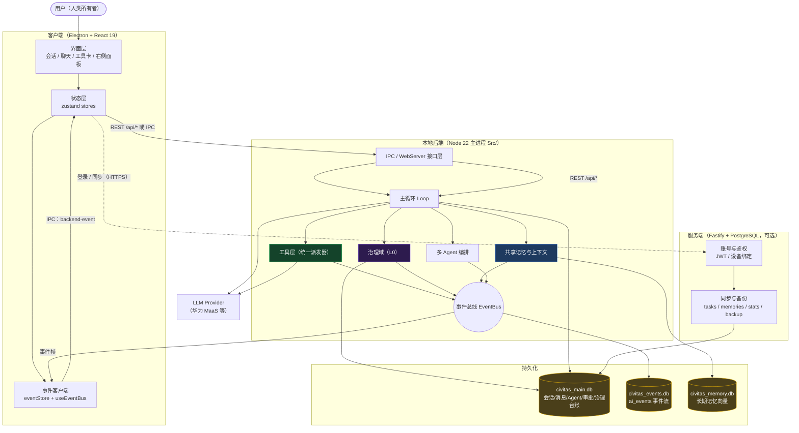
```mermaid
flowchart TB
  User(["用户（人类所有者）"]) --> UI

  subgraph CLIENT["客户端（Electron + React 19）"]
    UI["界面层<br/>会话 / 聊天 / 工具卡 / 右侧面板"] --> Store["状态层<br/>zustand stores"]
    Store --> EvClient["事件客户端<br/>eventStore + useEventBus"]
  end

  subgraph BACKEND["本地后端（Node 22 主进程 Src/）"]
    IPC["IPC / WebServer 接口层"]
    Loop["主循环 Loop"]
    Tools["工具层（统一派发器）"]
    Memory["共享记忆与上下文"]
    Gov["治理域（L0）"]
    Orchestrator["多 Agent 编排"]
    Bus(("事件总线 EventBus"))
    IPC --> Loop
    Loop --> Tools
    Loop --> Memory
    Loop --> Gov
    Loop --> Orchestrator
    Tools --> Bus
    Gov --> Bus
    Memory --> Bus
    Orchestrator --> Bus
  end

  subgraph STORE["持久化"]
    DB1[("civitas_main.db<br/>会话/消息/Agent/审批/治理台账")]
    DB2[("civitas_events.db<br/>ai_events 事件流")]
    DB3[("civitas_memory.db<br/>长期记忆向量")]
  end

  subgraph REMOTE["服务端（Fastify + PostgreSQL，可选）"]
    Auth["账号与鉴权<br/>JWT / 设备绑定"]
    Sync["同步与备份<br/>tasks / memories / stats / backup"]
  end

  Provider["LLM Provider<br/>（华为 MaaS 等）"]

  EvClient -->|"IPC：backend-event"| Store
  Bus -->|"事件帧"| EvClient
  Bus --> DB2
  Loop --> Provider
  Tools --> Provider
  Memory --> DB3
  Gov --> DB1
  Loop --> DB1
  IPC -->|"REST /api/*"| Loop
  Store -->|"REST /api/* 或 IPC"| IPC
  Store -.->|"登录 / 同步（HTTPS）"| Auth
  Auth --> Sync
  Sync --> DB1

  classDef gov fill:#2d1b4e,stroke:#8b5cf6,color:#fff
  classDef mem fill:#1e3a5f,stroke:#3b82f6,color:#fff
  classDef tool fill:#14432a,stroke:#22c55e,color:#fff
  classDef store fill:#4a3f1a,stroke:#eab308,color:#fff
  class Gov gov
  class Memory mem
  class Tools tool
  class DB1,DB2,DB3 store
```

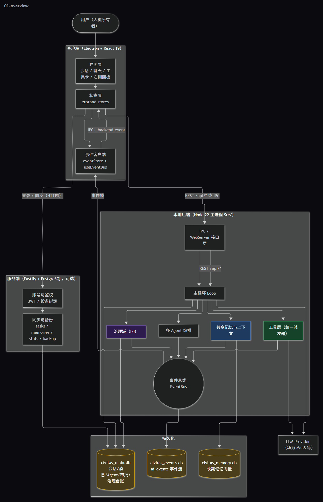

**主干读法**：用户 → 界面 → 状态 → 本地后端（循环 / 工具 / 记忆 / 治理 / 编排）→ 事件总线 → 落库 + 回推界面；服务端是**可选**的账号与同步面。

**省略说明**：WebSocket 通道（`Interface/WebSocket/`）当前仅历史遗留、非主链路；多窗口/多进程内存缓存失效策略未画。

---

## 2. 主循环模块（`Core/Loop/runIteration.ts`）

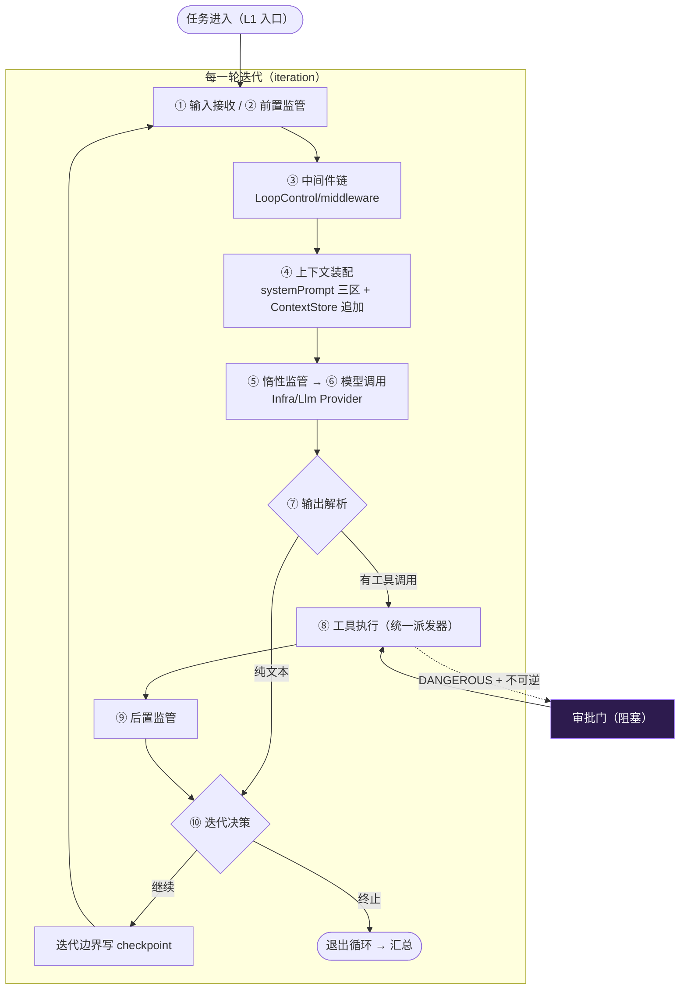
```mermaid
flowchart TB
  Start(["任务进入（L1 入口）"]) --> Pre
  subgraph LOOP["每一轮迭代（iteration）"]
    direction TB
    Pre["① 输入接收 / ② 前置监管"] --> MW["③ 中间件链<br/>LoopControl/middleware"]
    MW --> Ctx["④ 上下文装配<br/>systemPrompt 三区 + ContextStore 追加"]
    Ctx --> Call["⑤ 惰性监管 → ⑥ 模型调用<br/>Infra/Llm Provider"]
    Call --> Parse{"⑦ 输出解析"}
    Parse -->|"有工具调用"| Exec["⑧ 工具执行（统一派发器）"]
    Parse -->|"纯文本"| Decide
    Exec --> Post["⑨ 后置监管"]
    Post --> Decide{"⑩ 迭代决策"}
    Decide -->|"继续"| Snap["迭代边界写 checkpoint"]
    Decide -->|"终止"| End(["退出循环 → 汇总"])
    Snap --> Pre
  end
  Exec -.->|"DANGEROUS + 不可逆"| Gate["审批门（阻塞）"]
  Gate --> Exec

  classDef gov fill:#2d1b4e,stroke:#8b5cf6,color:#fff
  class Gate gov
```

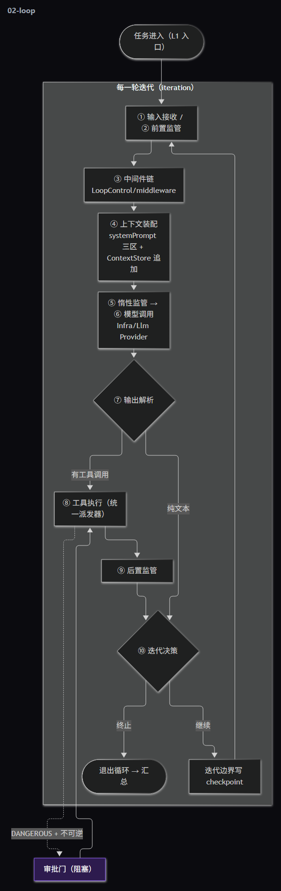

**关键不变量（有证据）**：系统提示**三区分离**（静态段冻结 + 会话段 + 回合段），工具数组**确定性排序** → 前缀稳定度实测 **99.9%**（旧构造 88.9%）；每轮末尾写迭代快照 `iterationCheckpoint`（修复前 `checkpointStore` 无运行期调用方）。

**省略说明**：token 预算/成本闸、Loop 级 stopRules 的具体规则表、压缩（compact）触发细节。

---

## 3. 工具层模块（`Tools/`）

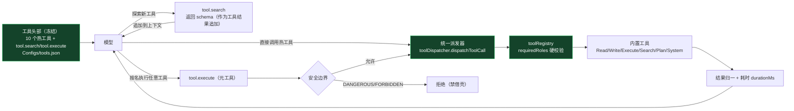
```mermaid
flowchart LR
  Header["工具头部（冻结）<br/>10 个热工具 + tool.search/tool.execute<br/>Configs/tools.json"] --> Model["模型"]
  Model -->|"直接调用热工具"| Disp
  Model -->|"探索新工具"| Search["tool.search<br/>返回 schema（作为工具结果追加）"]
  Search -->|"追加到上下文"| Model
  Model -->|"按名执行任意工具"| ExecTool["tool.execute（元工具）"]
  ExecTool --> Guard{"安全边界"}
  Guard -->|"DANGEROUS/FORBIDDEN"| Reject["拒绝（禁借壳）"]
  Guard -->|"允许"| Disp
  Disp["统一派发器<br/>toolDispatcher.dispatchToolCall"] --> Registry["toolRegistry<br/>requiredRoles 硬校验"]
  Registry --> Builtin["内置工具<br/>Read/Write/Execute/Search/Plan/System"]
  Builtin --> Result["结果归一 + 耗时 durationMs"] --> Model

  classDef tool fill:#14432a,stroke:#22c55e,color:#fff
  class Header,Disp,Registry tool
```

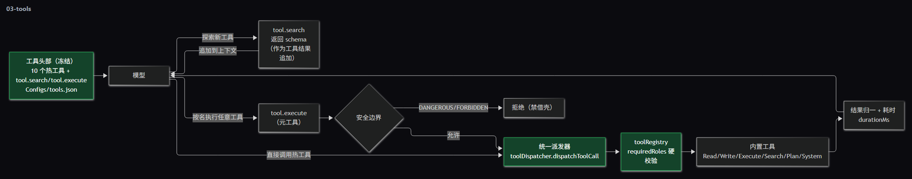

**关键不变量**：头部**字节恒定**（新工具只经探索追加，不进头部，以保 provider 前缀缓存）；全仓 `await executeTool(` **只允许出现在派发器内**；`tool.execute` 用**调用者角色**复核内层工具（无越权借壳）；工具层角色白名单已补 `regulator`（此前监管连 `file.read` 都不能用）。

**省略说明**：幂等缓存、EffectJournal 记账、沙箱细节。

---

## 4. 审批与治理门模块（`toolSafetyGate` → `approvalGate`）

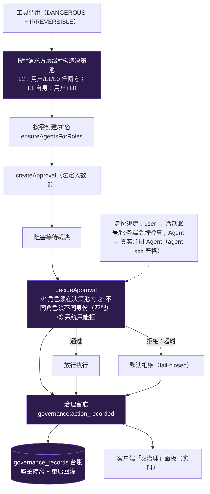
```mermaid
flowchart TB
  Call["工具调用（DANGEROUS + IRREVERSIBLE）"] --> Pool
  Pool["按**请求方层级**构造决策池<br/>L2：用户/L1/L0 任两方；L1 自身：用户+L0"] --> Ensure["按需创建/扩容<br/>ensureAgentsForRoles"]
  Ensure --> Create["createApproval（法定人数 2）"]
  Create --> Wait["阻塞等待裁决"]
  Wait --> Decide["decideApproval<br/>① 角色须在决策池内 ② 不同角色须不同身份（匹配）③ 系统只能拒"]
  Decide -->|"通过"| Exec["放行执行"]
  Decide -->|"拒绝 / 超时"| Deny["默认拒绝（fail-closed）"]
  Decide --> Trail
  Exec --> Trail["治理留痕<br/>governance:action_recorded"]
  Deny --> Trail
  Trail --> Ledger[("governance_records 台账<br/>属主隔离 + 重启回灌")]
  Trail --> Panel["客户端「⚖治理」面板（实时）"]

  Bind["身份绑定：user → 活动账号/服务端令牌验真；Agent → 真实注册 Agent（agent-xxx 严格）"] -.-> Decide

  classDef gov fill:#2d1b4e,stroke:#8b5cf6,color:#fff
  class Pool,Decide,Trail,Ledger gov
```

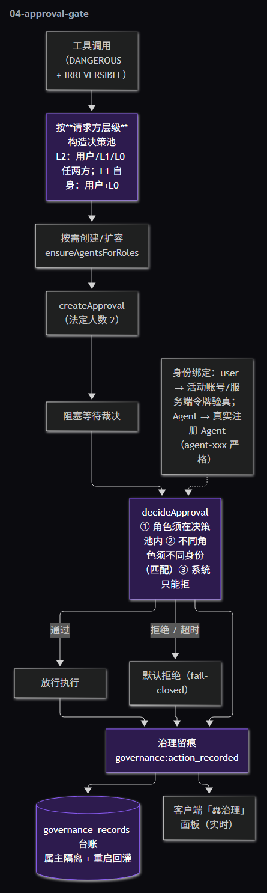

**关键不变量**：请求方角色**永不入池**（配置也改不掉）；**同一人换角色名不再满足多角色**（Kuhn 二分匹配）；`decidedBy` **不再直接采信**（自报身份作废 + 留痕 `approval.identity_mismatch`）；人类代理治理角色时**显式留痕** `approval.human_proxy`。

**省略说明**：自动审批白名单（`forceApprove`）、审批队列落库字段、客户端"单操作者模式"的多角色提交循环。

---

## 5. 治理域模块（审计 / 监管 / 仲裁 / 广播）

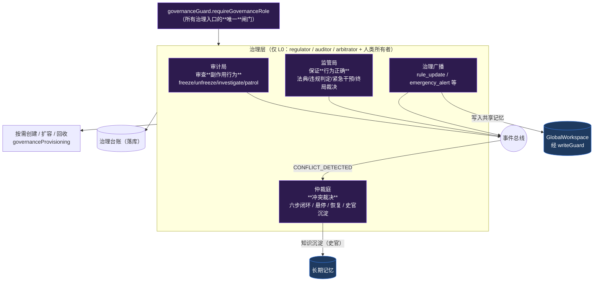
```mermaid
flowchart TB
  subgraph GOV["治理层（仅 L0：regulator / auditor / arbitrator + 人类所有者）"]
    direction LR
    Audit["审计局<br/>审查**副作用行为**<br/>freeze/unfreeze/investigate/patrol"]
    Reg["监管局<br/>保证**行为正确**<br/>法典/违规判定/紧急干预/终局裁决"]
    Arb["仲裁庭<br/>**冲突裁决**<br/>六步闭环 / 悬停 / 恢复 / 史官沉淀"]
    Cast["治理广播<br/>rule_update / emergency_alert 等"]
  end

  Guard["governanceGuard.requireGovernanceRole<br/>（所有治理入口的**唯一**闸门）"] --> GOV
  GOV --> Ledger[("治理台账（落库）")]
  GOV --> Pool["按需创建 / 扩容 / 回收<br/>governanceProvisioning"]
  Cast -->|"写入共享记忆"| GW[("GlobalWorkspace<br/>经 writeGuard")]
  Arb -->|"知识沉淀（史官）"| LTM[("长期记忆")]

  Bus(("事件总线")) -->|"CONFLICT_DETECTED"| Arb
  Audit --> Bus
  Reg --> Bus
  Cast --> Bus

  classDef gov fill:#2d1b4e,stroke:#8b5cf6,color:#fff
  classDef mem fill:#1e3a5f,stroke:#3b82f6,color:#fff
  class Audit,Reg,Arb,Cast,Guard gov
  class GW,LTM mem
```

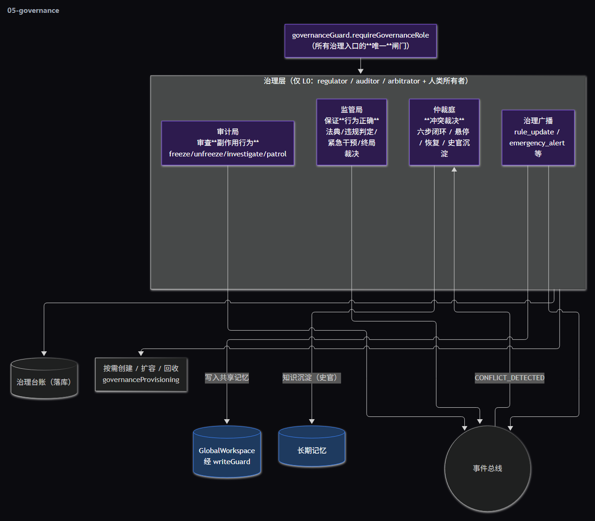

**职能部门边界（用户裁定，不可混淆）**：
`reviewer`＝审**生成内容**（L2，执行链，**非治理**）｜`audit`＝审**副作用行为**（L0）｜`regulation`＝管**行为正确性**（L0）｜`arbitration`＝裁**冲突**（L0）。

**关键不变量**：治理角色**不可被招募/伪造/赋权**（工厂 + 注册表双重拦截，`allowGovernance` 仅系统播种可用于受控路径）；**池位与 Agent 同步扩缩**（每池位一个独立身份）；回收走**软销毁**（库内 `destroyed_at` 留痕）。

**省略说明**：审判的具体裁决算法（Phase 0-2 规则裁决）、律师函挂起的时间参数、动态扩缩阈值细节。

---

## 6. 共享记忆与上下文模块（`Services/SharedMemory` + `Context`）

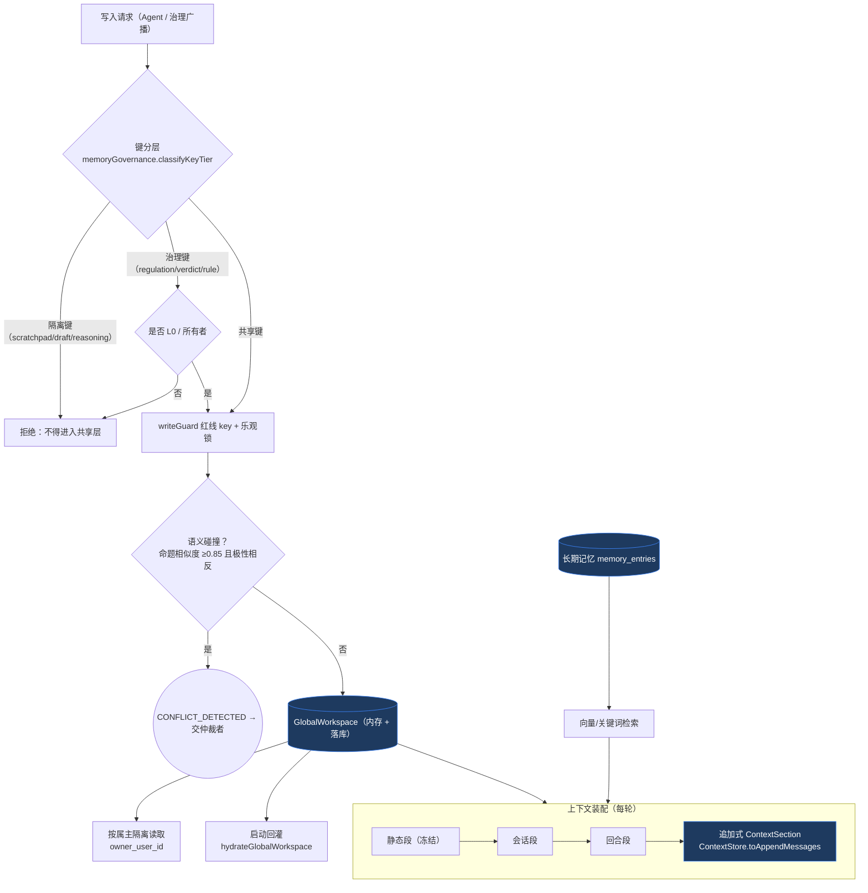
```mermaid
flowchart TB
  W["写入请求（Agent / 治理广播）"] --> Tier{"键分层<br/>memoryGovernance.classifyKeyTier"}
  Tier -->|"隔离键（scratchpad/draft/reasoning）"| Block["拒绝：不得进入共享层"]
  Tier -->|"治理键（regulation/verdict/rule）"| Role{"是否 L0 / 所有者"}
  Tier -->|"共享键"| Guard
  Role -->|"否"| Block
  Role -->|"是"| Guard["writeGuard 红线 key + 乐观锁"] --> Conflict{"语义碰撞？<br/>命题相似度 ≥0.85 且极性相反"}
  Conflict -->|"是"| CD(("CONFLICT_DETECTED → 交仲裁者"))
  Conflict -->|"否"| GW[("GlobalWorkspace（内存 + 落库）")]
  GW --> Owner["按属主隔离读取<br/>owner_user_id"]
  GW --> Hydrate["启动回灌<br/>hydrateGlobalWorkspace"]

  subgraph CTX["上下文装配（每轮）"]
    direction LR
    Static["静态段（冻结）"] --> Session["会话段"] --> Turn["回合段"]
    Turn --> Append["追加式 ContextSection<br/>ContextStore.toAppendMessages"]
  end
  GW --> CTX
  LTM[("长期记忆 memory_entries")] --> Retrieve["向量/关键词检索"] --> CTX

  classDef mem fill:#1e3a5f,stroke:#3b82f6,color:#fff
  class GW,LTM,Append mem
```

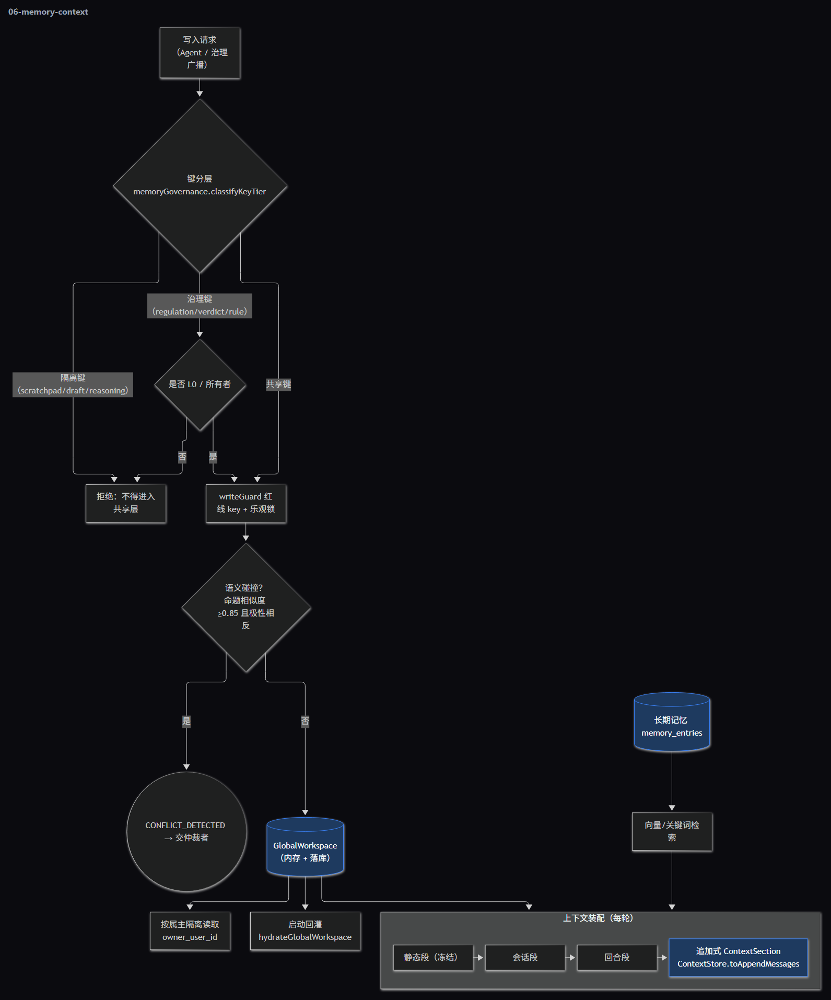

**关键不变量**：**中间过程物理隔离**（隔离键禁入共享层）；**全链路可追溯**（变更强制携带四类元数据）；同键同内容幂等（不改位置），不同内容原位替换。

**省略说明**：写死的向量维度、压缩（compact）策略、上下文分区权重。

---

## 7. 多 Agent 编排与招募模块（`Core/Decision` + `Services/Recruitment`）

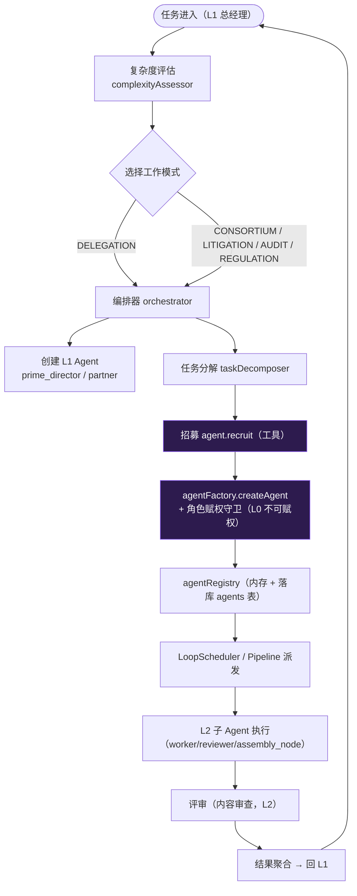
```mermaid
flowchart TB
  Task(["任务进入（L1 总经理）"]) --> Assess["复杂度评估<br/>complexityAssessor"]
  Assess --> Mode{"选择工作模式"}
  Mode -->|"DELEGATION"| Orc["编排器 orchestrator"]
  Mode -->|"CONSORTIUM / LITIGATION / AUDIT / REGULATION"| Orc
  Orc --> Direct["创建 L1 Agent<br/>prime_director / partner"]
  Orc --> Decomp["任务分解 taskDecomposer"]
  Decomp --> Recruit["招募 agent.recruit（工具）"]
  Recruit --> Fact["agentFactory.createAgent<br/>+ 角色赋权守卫（L0 不可赋权）"]
  Fact --> Reg["agentRegistry（内存 + 落库 agents 表）"]
  Reg --> Sched["LoopScheduler / Pipeline 派发"]
  Sched --> Sub["L2 子 Agent 执行（worker/reviewer/assembly_node）"]
  Sub --> Review["评审（内容审查，L2）"]
  Review --> Agg["结果聚合 → 回 L1"]
  Agg --> Task

  classDef gov fill:#2d1b4e,stroke:#8b5cf6,color:#fff
  class Recruit,Fact gov
```

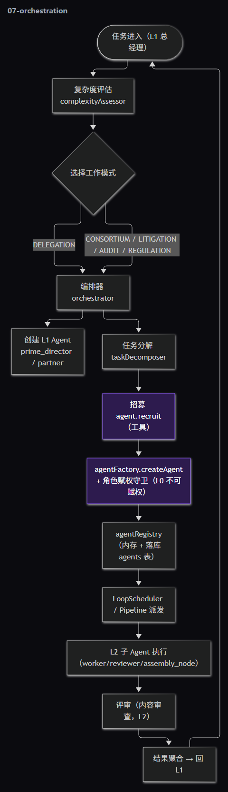

**关键不变量**：治理三权**不可被招募**（招募工具枚举排除 + 工厂/注册表双重守卫）；`MAX_LIVE_SUBAGENTS_PER_TRACE` 上限；父子关系落库（`agents.parent_agent_id`）+ 注册表旁挂 Map。

**省略说明**：五种模式的差异细则、token 预算分配、任务权威度（taskAuthority）。

---

## 8. 事件总线与可观测模块（`Services/EventBus` + `Interface/EventStore` + `IpcBridge`）

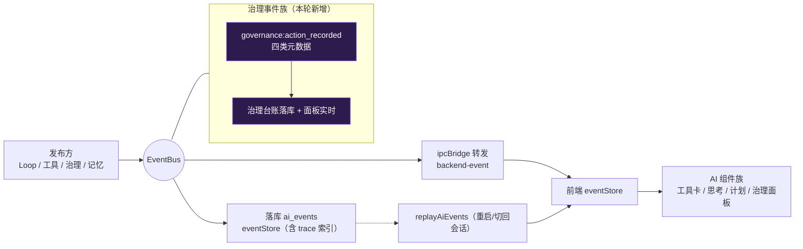
```mermaid
flowchart LR
  Prod["发布方<br/>Loop / 工具 / 治理 / 记忆"] --> Bus(("EventBus"))
  Bus --> Persist["落库 ai_events<br/>eventStore（含 trace 索引）"]
  Bus --> Fwd["ipcBridge 转发<br/>backend-event"]
  Fwd --> Client["前端 eventStore"]
  Client --> Comp["AI 组件族<br/>工具卡 / 思考 / 计划 / 治理面板"]
  Replay["replayAiEvents（重启/切回会话）"] --> Client
  Persist -.-> Replay

  subgraph GOVEVT["治理事件族（本轮新增）"]
    direction TB
    G1["governance:action_recorded<br/>四类元数据"] --> G2["治理台账落库 + 面板实时"]
  end
  Bus --- GOVEVT

  classDef gov fill:#2d1b4e,stroke:#8b5cf6,color:#fff
  class G1,G2 gov
```

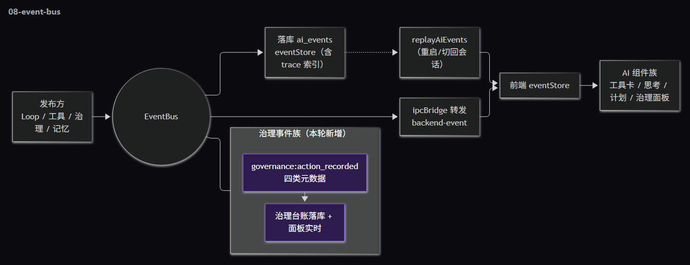

**关键不变量**：**实时与回放共用一条通路**（都进 `eventStore.pushEvent`），因此组件在"运行中"与"重启后"都能重建；治理事件**放行与拒绝都发**（越权尝试是有价值的治理事实）。

**省略说明**：全量事件转发的性能治理、节流策略（已知存在逐 token 推 IPC 的历史问题）。

---

## 9. 数据与持久化模块（`Infra/Db`）

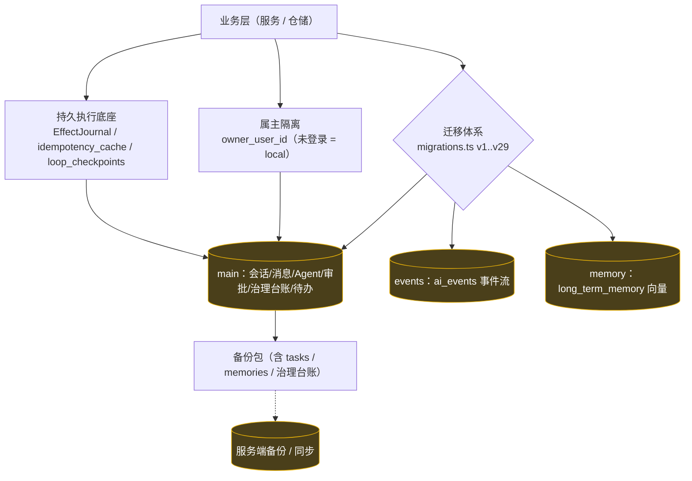
```mermaid
flowchart TB
  App["业务层（服务 / 仓储）"] --> Mig{"迁移体系<br/>migrations.ts v1..v29"}
  Mig --> Main[("main：会话/消息/Agent/审批/治理台账/待办")]
  Mig --> Ev[("events：ai_events 事件流")]
  Mig --> Mem[("memory：long_term_memory 向量")]
  App --> Own["属主隔离<br/>owner_user_id（未登录 = local）"]
  Own --> Main
  App --> Durable["持久执行底座<br/>EffectJournal / idempotency_cache / loop_checkpoints"]
  Durable --> Main
  Main --> Backup["备份包（含 tasks / memories / 治理台账）"]
  Backup -.-> Server[("服务端备份 / 同步")]

  classDef store fill:#4a3f1a,stroke:#eab308,color:#fff
  class Main,Ev,Mem,Server store
```

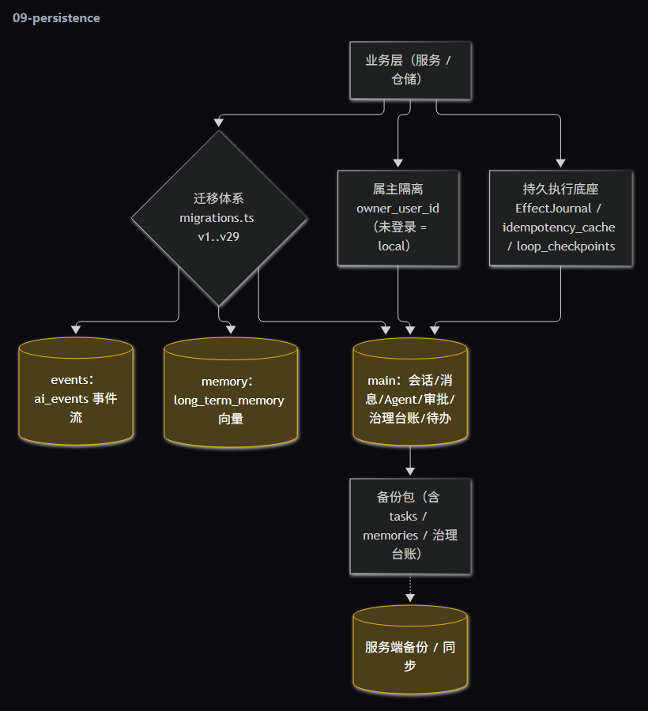

**关键不变量**：迁移**版本重复即 FATAL**（防静默跳过）；新增列前必须查是否已存在（本会话曾因重复 `ALTER` 触发 `duplicate column` 使整库迁移失败）；`loop_checkpoints`/`effect_journal` 依赖 `loops` 父行（现已由 `ensureLoopRow` 补齐）。

**省略说明**：WAL/同步级别（main=FULL）、索引清单、备份加密（已知明文，待办）。

---

## 10. 服务端模块（`Server/`，独立包）

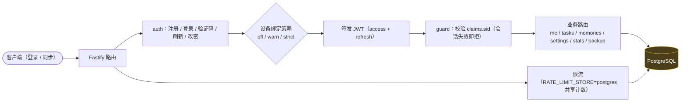
```mermaid
flowchart LR
  C(["客户端（登录 / 同步）"]) --> R["Fastify 路由"]
  R --> A["auth：注册 / 登录 / 验证码 / 刷新 / 改密"]
  A --> Bind{"设备绑定策略<br/>off / warn / strict"}
  Bind --> JWT["签发 JWT（access + refresh）"]
  JWT --> Guard["guard：校验 claims.sid（会话失效即拒）"]
  Guard --> Biz["业务路由<br/>me / tasks / memories / settings / stats / backup"]
  Biz --> PG[("PostgreSQL")]
  R --> RL["限流（RATE_LIMIT_STORE=postgres 共享计数）"]
  RL --> PG

  classDef store fill:#4a3f1a,stroke:#eab308,color:#fff
  class PG store
```

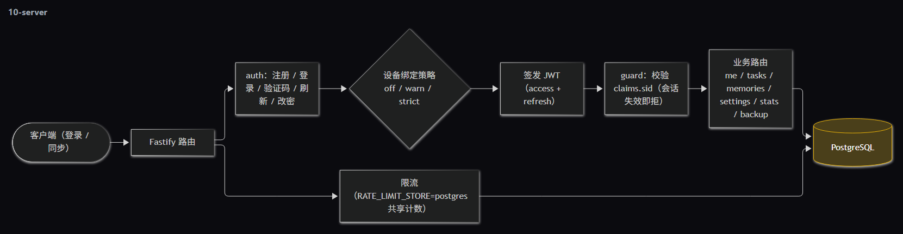

**关键不变量**：`MAIL_WEBHOOK_URL` 在生产**fail-closed**；验证码**哈希+过期+锁定**；installed-credential（sha256）用于设备绑定；账号隔离由 `user_id` 贯穿全部业务表。

**省略说明**：迁移漂移检测细节、备份包字段级 schema、部署 Runbook。

---

## 11. 客户端前端模块（`Client/src`）

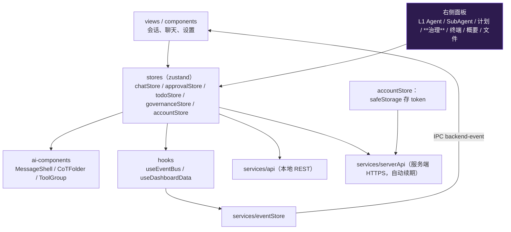
```mermaid
flowchart TB
  View["views / components<br/>会话、聊天、设置"] --> Stores["stores（zustand）<br/>chatStore / approvalStore / todoStore / governanceStore / accountStore"]
  Stores --> AIComp["ai-components<br/>MessageShell / CoTFolder / ToolGroup"]
  Stores --> Hook["hooks<br/>useEventBus / useDashboardData"]
  Hook --> ES["services/eventStore"]
  ES -->|"IPC backend-event"| View
  Stores --> API["services/api（本地 REST）"]
  Stores --> Srv["services/serverApi（服务端 HTTPS，自动续期）"]
  Token["accountStore：safeStorage 存 token"] --> Srv
  Panel["右侧面板<br/>L1 Agent / SubAgent / 计划 / **治理** / 终端 / 概要 / 文件"] --> Stores

  classDef gov fill:#2d1b4e,stroke:#8b5cf6,color:#fff
  class Panel gov
```

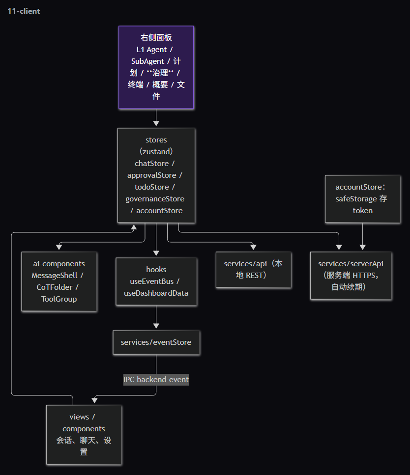

**关键不变量**：AI 组件（工具/思考/计划/治理）**只要被创建就必须可持久化与重建**（消息富结构 + 事件回放）；zustand 选择器**必须返回稳定引用**（本会话曾因返回新对象导致 `getSnapshot` 无限重渲染崩溃）。

**省略说明**：主题/骨架屏、虚拟滚动、节流常量。

---

## 12. 决策与工作模式模块（`Core/Decision`）

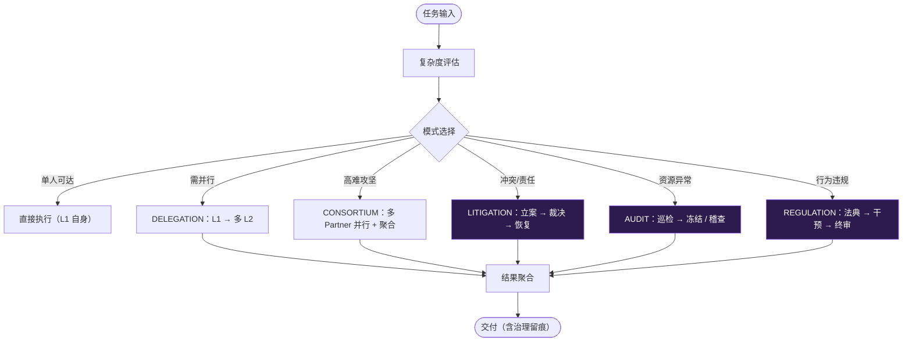
```mermaid
flowchart TD
  In(["任务输入"]) --> Complex["复杂度评估"]
  Complex --> Chooser{"模式选择"}
  Chooser -->|"单人可达"| Direct["直接执行（L1 自身）"]
  Chooser -->|"需并行"| Dele["DELEGATION：L1 → 多 L2"]
  Chooser -->|"高难攻坚"| Cons["CONSORTIUM：多 Partner 并行 + 聚合"]
  Chooser -->|"冲突/责任"| Liti["LITIGATION：立案 → 裁决 → 恢复"]
  Chooser -->|"资源异常"| Au["AUDIT：巡检 → 冻结 / 稽查"]
  Chooser -->|"行为违规"| Regu["REGULATION：法典 → 干预 → 终审"]
  Dele --> Agg["结果聚合"]
  Cons --> Agg
  Liti --> Agg
  Au --> Agg
  Regu --> Agg
  Agg --> Out(["交付（含治理留痕）"])

  classDef gov fill:#2d1b4e,stroke:#8b5cf6,color:#fff
  class Liti,Au,Regu gov
```

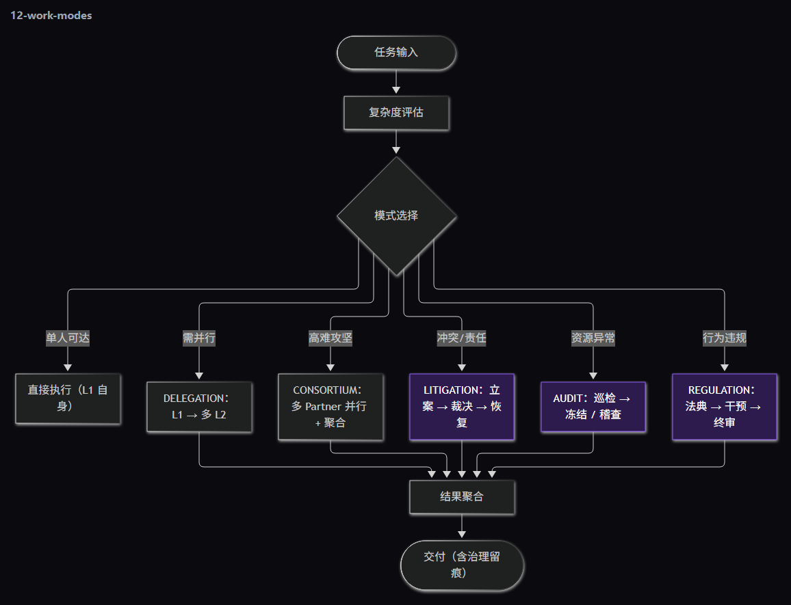

**省略说明**：模式切换阈值、仲裁模型数量（`routing.arbitrationModels ≥ 3` 校验）、各模式的提示词模板差异。

---

## 13. 本文依据（可核对）

| 图 | 主要代码依据 |
|----|-------------|
| 总图 | `Src/main.ts`（启动编排 ⑦.x）、`Src/Interface/{IpcBridge,WebServer,RestApi}` |
| 主循环 | `Src/Core/Loop/runIteration.ts`、`Services/LoopControl/middleware/*`、`Infra/DurableExecution/iterationCheckpoint.ts` |
| 工具层 | `Src/Tools/Registry/{toolHeader,toolDispatcher,toolRegistry}.ts`、`Configs/tools.json`、`Src/Tools/roles.ts` |
| 审批门 | `Services/LoopControl/middleware/toolSafetyGate.ts`、`Services/LoopControl/approvalGate.ts`、`Services/Governance/approvalIdentity.ts` |
| 治理域 | `Services/{Audit,Regulation,Arbitration}/*`、`Services/Governance/{governanceGuard,governanceAudit,governanceProvisioning}.ts` |
| 记忆上下文 | `Services/SharedMemory/{globalWorkspace,writeGuard,memoryGovernance,longTermMemory}.ts`、`Services/Context/contextStore.ts` |
| 编排招募 | `Core/Decision/*`、`Services/Recruitment/recruiter.ts`、`Tools/Custom/agentRecruiter.ts`、`Core/AgentRuntime/*` |
| 事件可观测 | `Services/EventBus/*`、`Interface/EventStore/*`、`Client/src/stores/eventStore.ts` |
| 持久化 | `Infra/Db/migrations.ts`、`Infra/Db/Repositories/*`、`Infra/DurableExecution/*` |
| 服务端 | `Server/src/routes/*`、`Server/src/services/*`、`Server/migrations/*` |
| 前端 | `Client/src/{stores,components,ai-components,services}` |
| 工作模式 | `Core/Decision/{complexityAssessor,TaskDecomposer,orchestrator}` |

---

## 14. 待补（诚实标注，避免图与代码漂移）

1. **Qoder FE-060~062 新增的 17 个治理端点**尚未接入"身份门"（`actorRole` 由请求体自报）——图中治理域已画为 L0 门，但**HTTP 面目前是"角色名门"**；
2. **WebSocket 通道**（`Interface/WebSocket/`）历史遗留，未画入主干；
3. **多窗口/多进程内存缓存失效**策略未实现（`GlobalWorkspace` 读取虽合并持久化，但别进程写入不会主动失效本进程缓存）；
4. `Services/{Pipeline,LoopScheduler}` 的调度语义在代码中仍偏骨架（Qoder 正在接线，图中只画了派发位置）。
